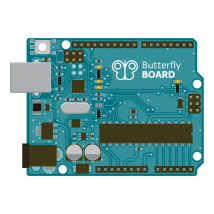
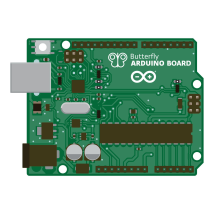
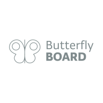
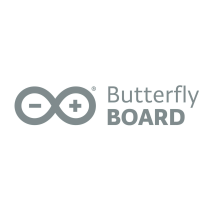

This article covers the basic trademark rules you must follow when developing products based on (or compatible with) Arduino. By following these guidelines, you will be able to develop, share, and even commercialize your products without violating Arduino’s Intellectual Property.

> A compatible product is a product, such as a board, derived from an Arduino board and compatible with the Arduino IDE. A compatible product can be manufactured by a different company and have its own brand, or be unbranded. Compatible products are perfectly legal to make, use and sell, as long as they don’t violate any of Arduino’s trademarks.

<table>
  <tr>
    <th>Do</th>
    <th>Don't</th>

  </tr>
  <tr>
    <td></td>
    <td></td>
  </tr>
  <tr>
  </table>

---

## Open source and compatible products

Most hardware designs of Arduino are open source. Copying and further developing these designs is allowed, however:

* It is **not allowed** to print the word *Arduino* or the  Arduino logo on the board. Manufacturing and selling counterfeits is illegal.

* It is **not allowed** to call your compatible product *Arduino*, even if you copied the design from Arduino. Your finished product is a product compatible with Arduino and should have its own name and brand.

## Logo

If you want your compatible product to carry a logotype, you should develop your own. Your logo should be clearly distinguishable from the Arduino logo, even if your product is derived from the Arduino technology.

You are not allowed to use the Arduino logo in connection with the compatible product you have developed. This includes: printing the logo on the product, on the packaging, or on any promotional material advertising your product (including social media).

Modified versions of the Arduino logo are considered trademark violations.

## Name

It is understandable that compatible brands want to make a reference to Arduino®, in order for their customers to easily identify what type of product it is.

To indicate that your product is compatible with Arduino, you should use the correct phrasing. For example:

* “Compatible with Arduino”
* “For Arduino”
* “Based on Arduino”.

> Always place the word Arduino last.

### Catalog and websites

The word Arduino is a brand name, not a category. Therefore, you should clearly separate original Arduino products and compatible products in your catalog or website.

### Company name

The Arduino name cannot be included in a company name even if the company uses the same technology as Arduino. This includes domain names too.

## Examples

<table>
  <tr>
    <th>Issue</th>
    <th>Do</th>
    <th>Don't</th>
  </tr>
  <tr>
    <td>Product name</td>
    <td>Butterfly Board  - compatible with Arduino</td>
    <td>Butterfly Arduino Board </td>
  </tr>
  <tr>
    <td>Product name</td>
    <td>Ladybird Shield for Arduino</td>
    <td>Arduino Ladybird Shield</td>
  </tr>
  <tr>
    <td>Product name</td>
    <td>Grasshopper Starter Kit based on Arduino</td>
    <td>Grasshopper Arduino Starter Kit </td>
  </tr>
  <tr>
    <td>Logo</td>
    <td></td>
    <td></td>
  </tr>
  <tr>
    <td>Product Category</td>
    <td  style="vertical-align: top;">
      Product menu:
      <li>Arduino®<ul>
        <li>Arduino® boards</li>
        <li>Arduino® Kits</li>
        </ul>
        <li>Compatible with Arduino<ul>
          <li>Butterfly boards</li>
          <li>Grasshopper kits</li>
          </ul>
      </li>
    </td>
    <td  style="vertical-align: top;">
      Product menu:
          <li>Arduino<ul>
            <li>Butterfly boards</li>
            <li>Grasshopper kits</li>
            <li>Generic UNO boards</li>
            </ul>
       </li>
     </td>
     </tr>
  <tr>
    <td>Website name</td>
    <td>www.butterfly.com</td>
    <td>www.butterflyarduino.com</td>
  </tr>
  <tr>
  </table>
