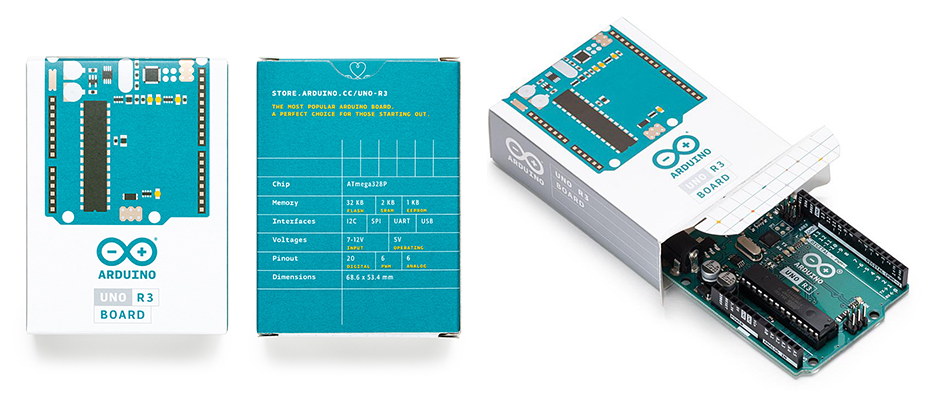
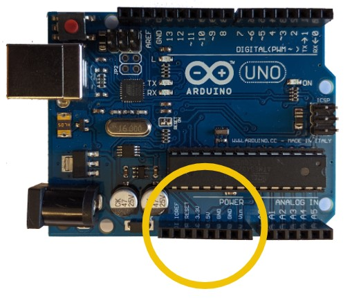

This article covers the issue of counterfeit boards – how to identify them and warning signs to look out for in stores. Let us first differentiate between compatible and counterfeit boards.

* **Compatible:** When a third-party product has copied the open-source hardware design and uses its own brand name. No problem!
* **Counterfeit:** When a third-party product uses the Arduino name and/or logo directly on the product, or in the store, to deceive customers. Not cool!

> It is fine for compatible brands to *reference* Arduino, in order for their customers to easily identify what type of product it is. Read more about trademark use in relation to compatible products [here](https://support.arduino.cc/hc/en-us/sections/360004749260-Compatible-Products).

## How to identify a counterfeit board

### Packaging

Individually sold Arduino boards come packaged in a compact, well-made cardboard box.

* The top side should have a graphic of the board.
* The bottom side should list specifications for the board.

Counterfeits may come packaged in cheaper and generic packaging, like a plastic antistatic bag or zipper bag.

### Color and silkscreen

<!-- TODO: See word doc changes -->

The silkscreen is a layer of ink trace that contains logos, symbols, and text used to identify components. It also provides the board with a background color. Many of our most popular boards, particularly the [Arduino UNO Rev3](https://store.arduino.cc/arduino-uno-rev3) (which has the most counterfeits) are today produced with our new teal color. Virtually all counterfeits still use the blue color, and this can be a straightforward way of identifying a counterfeit.

<table class="img-captions">
  <tr>
     <td></td>
     <td></td>
  </tr>
  <tr>
     <td>"Original UNO Rev 3 (front)</td>
     <td>"Original UNO Rev 3 (back)</td>
  </tr>
  <tr>
     <td></td>
     <td></td>
  </tr>
  <tr>
     <td>"Original Due (front)</td>
     <td>"Original Due (back)</td>
  </tr>
</table>

### Logos and fonts

Key indicators of an original board are:

* The registered mark (®) next to the logo.
* Quality print with well-defined letters.
* Same font used for all text on the board.

Conversely, key indicators of a counterfeit board are:

* The trademark symbol (™) next to the logo.
* Lower quality print. The first letter in “Arduino” is often “filled in” due to poor quality control.
* Different fonts used for text printed on the board.

<table class="img-captions">
  <tr>
    <td></td>
    <td></td>
    <td></td>
  </tr>
  <tr>
    <td>Original board</td>
    <td>Counterfeit</td>
    <td>Counterfeit</td>
  </tr>
</table>

When you carefully observe the font in which 'Arduino' is written you can find a difference between the original and counterfeits. Counterfeits tend to overlook or not be able to reproduce the same quality.

<table class="img-captions">
  <tr>
    <td></td>
  </tr>
  <tr>
    <td>Counterfeit board with varying fonts.</td>
  </tr>
</table>

### Board components

On counterfeit boards the overall execution can be poorly made, e.g. the components are sloping.

**The PTC fuse** (depicted below) should be a custom golden-black, with "501K" or similar printed on it, or the Arduino infinity symbol on newer boards. On a counterfeit, it may be a generic component, with a green color or otherwise different.

<table class="img-captions">
  <tr>
    <td></td>
    <td></td>
    <td></td>
  </tr>
  <tr>
    <td>Original board</td>
    <td>Original board</td>
    <td>Counterfeit</td>
  </tr>
</table>

**LED indicator lights** can also indicate a counterfeit. Arduino boards use the following colors for on-board LEDs:

* Green for power.
* Yellow for most other signaling.
* RGB LEDs for some newer boards.

A board using a red LED for power or signaling indicates a counterfeit.

### Examples

<table class="img-captions">
  <tr>
    <td></td>
    <td></td>
  </tr>
  <tr>
    <td>Arduino UNO Rev3</td>
    <td>Counterfeit UNO</td>
  </tr>
  <tr>
    <td></td>
    <td></td>
  </tr>
  <tr>
    <td>Arduino UNO SMD</td>
    <td>Counterfeit UNO SMD</td>
  </tr>
  <tr>
  <tr>
    <td></td>
    <td></td>
  </tr>
  <tr>
    <td>Arduino Mega</td>
    <td>Counterfeit Mega</td>
  </tr>
  <tr>
</table>

## How to avoid buying a counterfeit board

These tips can help you avoid buying a counterfeit in the first place.

### Use the Arduino store as a reference

Even if you're not using the [Arduino Store](https://store.arduino.cc/), it is still a useful reference for product names, colors, and prices.

### Naming and descriptions

Look out for phrases like "clone" or "for Arduino". These phrases are normally used to identify non-Arduino boards and components. They can be compatible boards and not counterfeits, but they are **not** original Arduino products.

### Photos

* Photos taken from the Arduino Store.
* Non-matching photos. A closeup may depict an official Arduino board, while a wider image of the kit may include the actual counterfeit.
* Photos that are angled or blurry so it is difficult to see the details.

### Manufacturing and distribution

* Arduino is the only manufacturer of Arduino products.
* There are no special versions of Arduino boards released in specific geographical regions, e.g. an "official Chinese version”.
* All Arduino boards are assembled in Italy.
* See [this page](https://store.arduino.cc/distributors) for information on our official distributors around the world.

### Pricing

If an Arduino product is being sold online for less than in the Arduino store, it may be a counterfeit.

Please note that purchasing an official Arduino product will support:

* Developing new open-source hardware
* Producing documentation
* CE/FCC certification
* Carbon offsetting
* Quality control
* Community management
* Publishing tutorials
* Make donations to other open-source projects
* Hosting and maintaining websites and forums for millions of users
