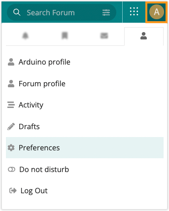
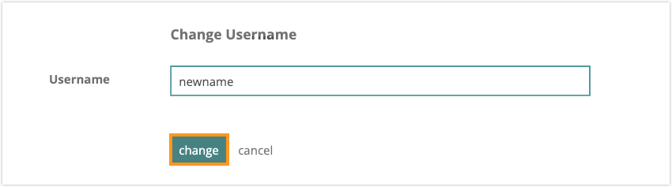

By default, your forum username will be the same as your Arduino account. If you prefer to use a different username in the forum, this can be configured in the forum preferences. Follow the steps below to change your forum username.

---

## When you can change your username

After registering your account you have 3 days to change your username.

---

## How to change your username

1. Go to the [Arduino Forum](https://forum.arduino.cc/) and log in to your account.

2. Click on your profile picture in the top-right to open the menu. Click the  tab, then click on **Preferences**.

   

3. Under **Username**, your current forum username will be displayed. Click the pencil icon next to it.

   

4. Enter a new username and click on **change**.

   
