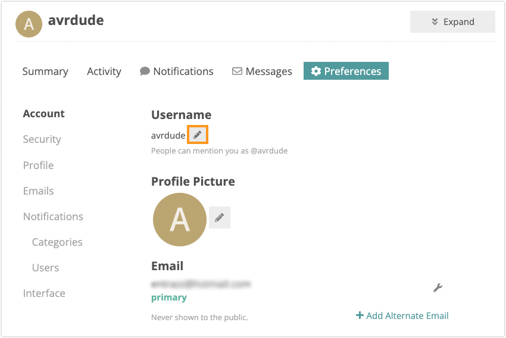

By default, your forum username will be the same as your Arduino account. If you prefer to use a different username in the forum, this can be configured in the forum preferences. Follow the steps below to change your forum username.

---

1. Sign in to your [Arduino Forum](https://forum.arduino.cc/) account.

2. Click on your profile picture, select the Preference tab and click on Preferences.

   

3. Under the **Username** heading, your current forum username will be displayed. Click the pencil icon next to it.

   

4. Type in the new username.

5. Click on **Change**.
