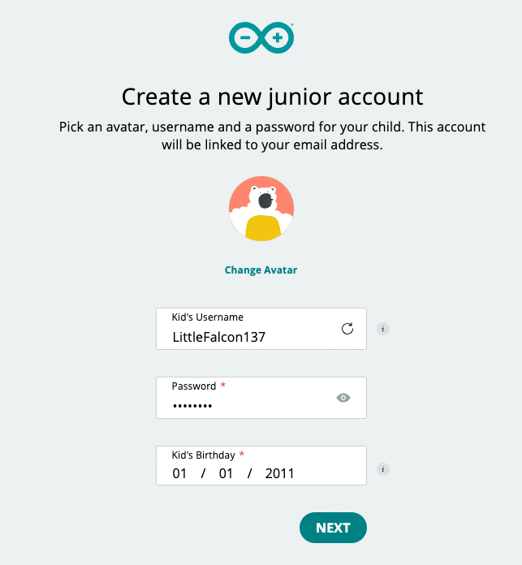
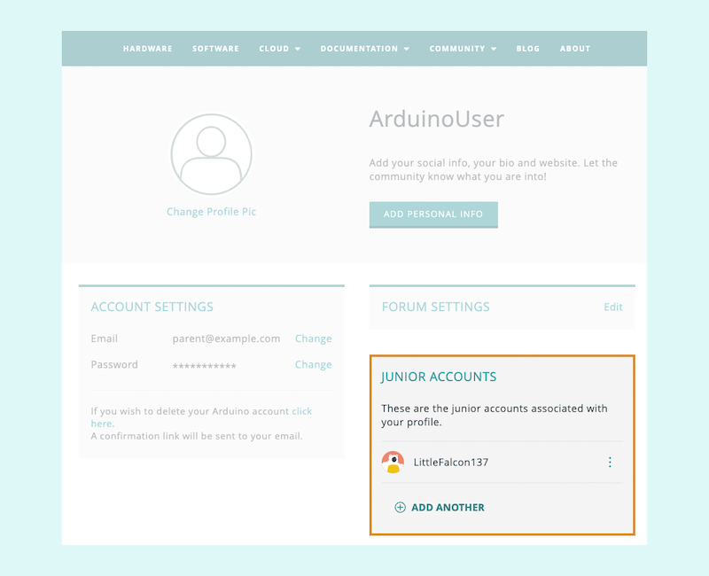
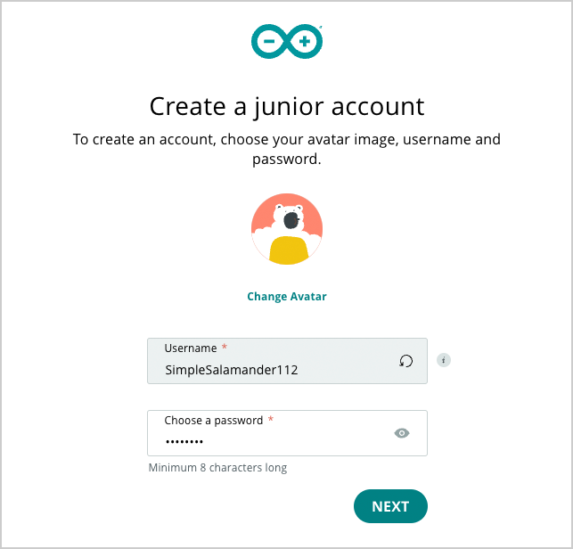
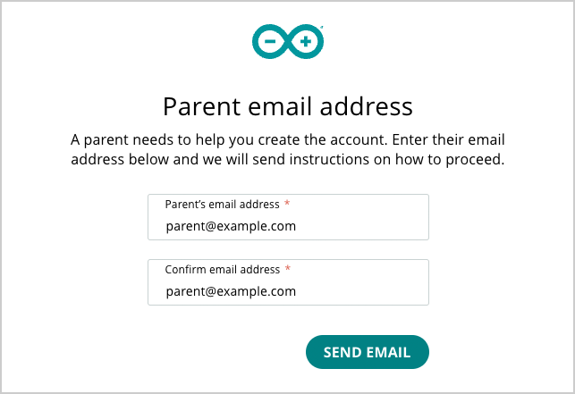

Minors under the age of 14 need parental consent to sign up for an Arduino account. This is called a **junior account**.

* Adults can [create junior accounts from their profile page](#adult-create).
* Juniors can also [request permission from their parents](#junior-request).

---

<h2 id="adult-create">Sign up your junior from an adult account</h2>

1. Go to the [Profile page](https://id.arduino.cc/). Sign in if prompted or, if you haven't done so, [create an Arduino account](https://support.arduino.cc/hc/en-us/articles/360016724040).

2. Under _Junior Accounts_, click on **Set Up Junior Account**.

   

3. Enter the following profile info:

   * Optional: Change the avatar.
   * Optional: Regenerate the randomly assigned username.
   * **Required:** Enter a password.
   * **Required:** Enter the junior's date of birth.

   When done, click **Next**.

   

4. Agree to the terms of parental consent and click Create Account.

The junior account will be created and added to the Junior Accounts section.

---

<h2 id="junior-request">Request permission as a junior</h2>

1. Go to [arduino.cc](https://www.arduino.cc/) and click Sign In in the top-right to open the [sign-in page](https://login.arduino.cc/login).

   

   > If another account is signed in, click the  profile button and select 'Sign Out' first.

2. Below the **Sign In** button, find the text "Don't have an account yet?", and click on **Create one** to proceed.

   

3. Enter your date of birth, then click on Next.

   

4. Enter the following profile info:

   * Optional: Change the avatar.
   * Optional: Regenerate your randomly assigned username.
   * **Required:** Enter a password.

   

5. Type in your parent's email address in both fields. Make sure that you provide the correct email address. Click on **Send Email**.

   

An email will be sent to your parent with instructions on how to finalize your account.
