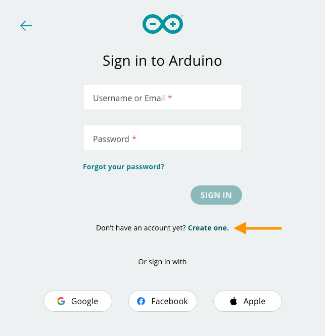
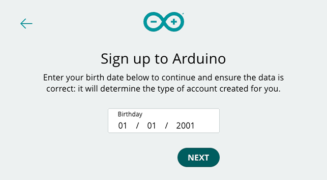
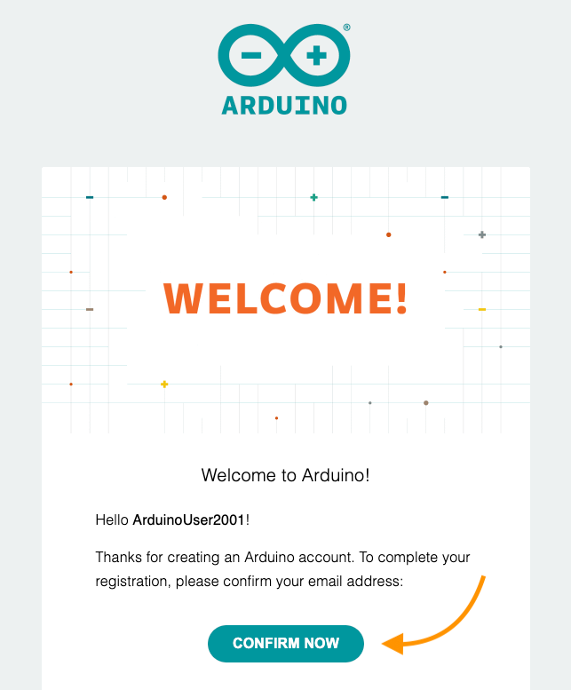
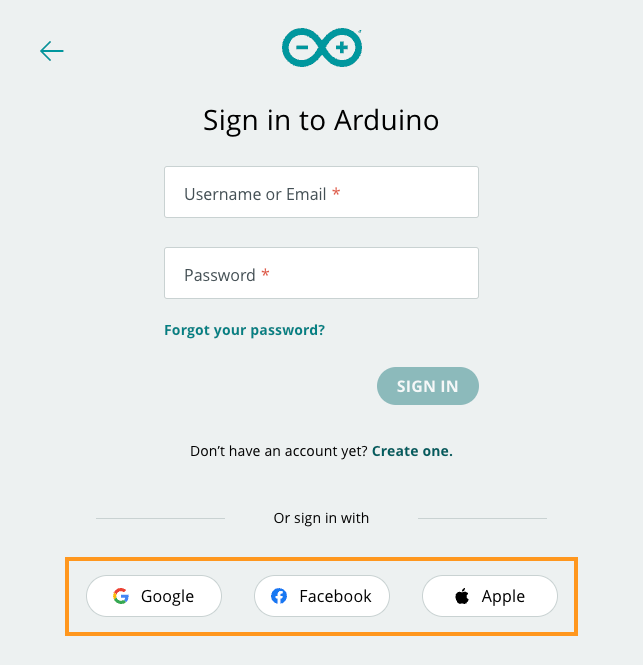
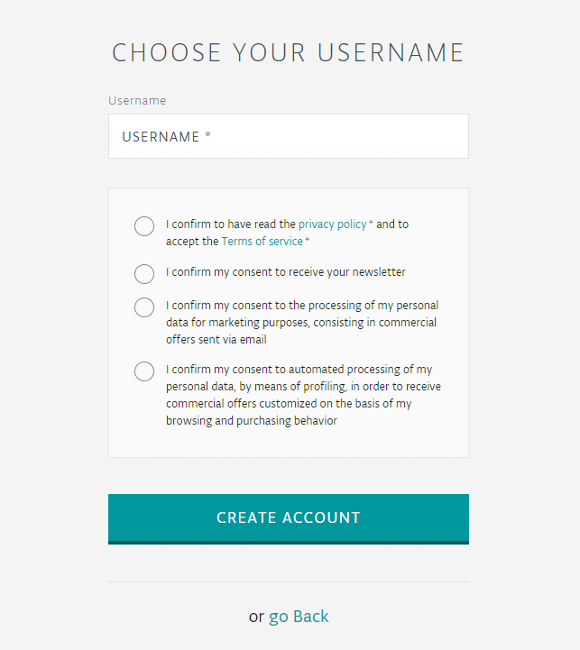

An Arduino account gives you full access to all Arduino websites, apps, and services.

There are two ways to sign up for an account:

* [Email](#email)
* [SSO (Singe Sign On)](#sso)

> Users under the age of 14 need to [sign up for a junior account](https://support.arduino.cc/hc/en-us/articles/360022234360).

---

<h2 id="email">Sign up with email</h2>

1. Go to [arduino.cc](https://www.arduino.cc/) and click Sign In in the top-right to open the [sign-in page](https://login.arduino.cc/login).

   

   > If another account is signed in, click the  profile button and select 'Sign Out' first.

2. Below the **Sign In** button, find the text "Don't have an account yet?", and click on **Create one** to proceed.

   

3. Enter your date of birth, then click on Next.

   

   > Users under the age of 14 need to [sign up for a junior account](https://support.arduino.cc/hc/en-us/articles/360022234360).

4. Enter the following:

   * The email address you want to be linked to your account
   * A username
   * A password

   You also need to accept the **Privacy Policy** and **Terms of Service**.

   

5. Click the **Sign Up** button. You will be redirected to the main website.

6. You will now receive a confirmation email with an account activation link.

   Click the CONFIRM NOW button to finish setting up the account.

   

   > If you don't see the email in your main inbox, please check the spam folder.

You can review your account and configure your account on [the profile page](https://id.arduino.cc/).

---

<h2 id="sso">Sign up with SSO (Single Sign On)</h2>

Alternatively, you can sign in using an identity provider such as Google or Facebook.

1. Go to [arduino.cc](https://www.arduino.cc/) and click Sign In in the top-right to open the [sign-in page](https://login.arduino.cc/login).

   > If another account is signed in, click the  profile button and select 'Sign Out'.

   

2. Select one of the SSO options.

   

3. Follow the instructions to authenticate with your identity provider.

4. Select a username and approve the required  click **Create Account**.

   

You can review your account and configure your account on [the profile page](https://id.arduino.cc/).

---

## Further reading

* [Create an Arduino account for juniors](https://support.arduino.cc/hc/en-us/articles/360022234360)
* [Delete an Arduino account](https://support.arduino.cc/hc/en-us/articles/360017090920)
