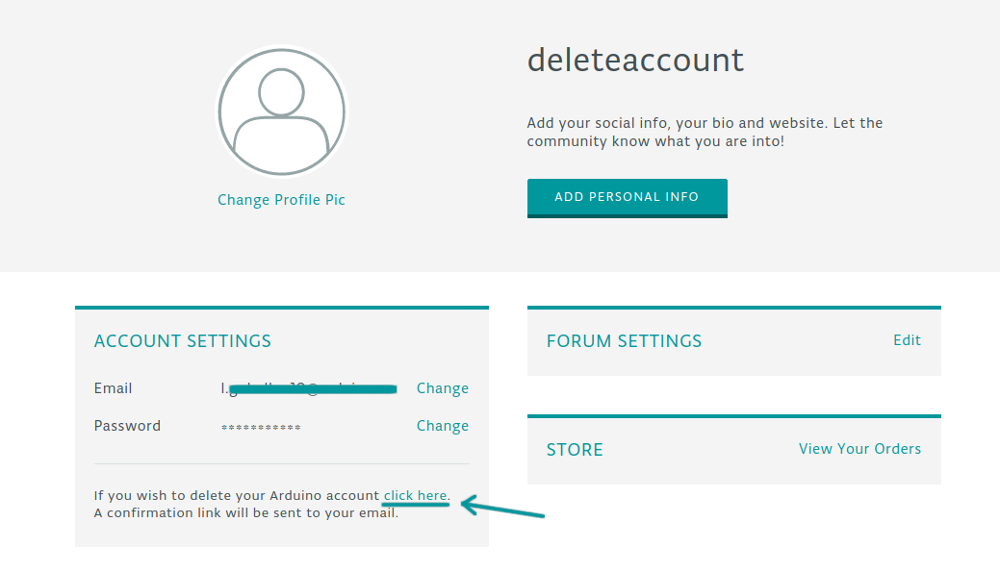
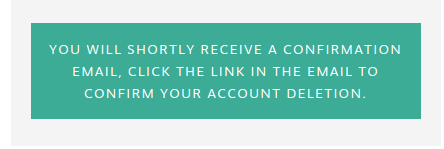
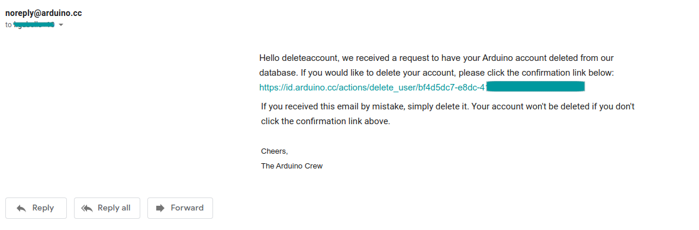
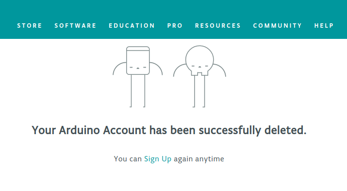

1. Sign in to the Arduino account that you would like to delete and go to [your profile page](https://id.arduino.cc/).

   

2. Under the `account settings` section, click on the link provided in the `delete your Arduino account` area.

   

3. Once clicked you will be shown a pop-up confirmation, asking you to confirm the deletion by clicking on the link sent to your e-mail account.

   

4. Once you click the confirmation link, your account will be permanently deleted, click on it if and only if you are sure.
If you don’t click on it, your account will not be deleted.

   

5. Done! Your account is permanently deleted, and all your data will be removed from our database.

   
