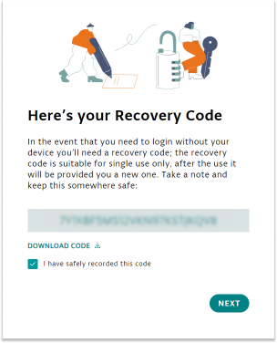

By enabling 2-Step Verification for your Arduino account, you add an extra layer of security in case your password is stolen.

---

## About authenticator apps

To use 2-step Verification, you will need an authenticator or password manager app with time-based one-time password (TOTP) support.

These are some popular choices:

* 1Password
* Twilio Authy
* Google Authenticator
* Microsoft Authenticator
* LastPass

## Enable 2-Step Verification

1. Sign into [id.arduino.cc/security](https://id.arduino.cc/security).

1. Find the _2 steps verification_ section.

1. Click **Activate** to begin the activation process for 2 step verification.

1. Open your preferred authenticator app (e.g., Authy, Google Authenticator, Microsoft Authenticator).

   Add a new account in the authenticator app, scan the displayed QR code in the window and click **Next**.

   

   > [!TIP]
   > If you can't scan the QR code, click "Can't scan the barcode?" to view the code in text format. Save this code as a one-time password for Arduino in your authenticator app.

1. Your authenticator app will generate a **six-digit code** that changes every 30 seconds. Enter this code into the text field in the window and click **Verify**.

   

1. The window will now display a **Recovery Code**. Save this code in a secure location.

   

   You will need the recovery code if you lose access to your authenticator app, such as if your phone is lost or broken.

   > [!IMPORTANT]
   > If you lose access to both your authenticator app and the recovery code, you will not be able to access your Arduino account, and Arduino support will be unable to assist you.

1. Enter the code from your authenticator app one more time to complete the setup.
