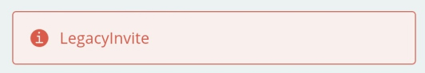

Sometimes when resetting the password for your account, after yo add your recovery mail address, you will get this error: `LegacyInvite`.

This error happens when the mail you provided was invited from an Educational kit, but that invite was never accepted. In this case you will have to accept the invite link received in the mail to complete the account creation.
