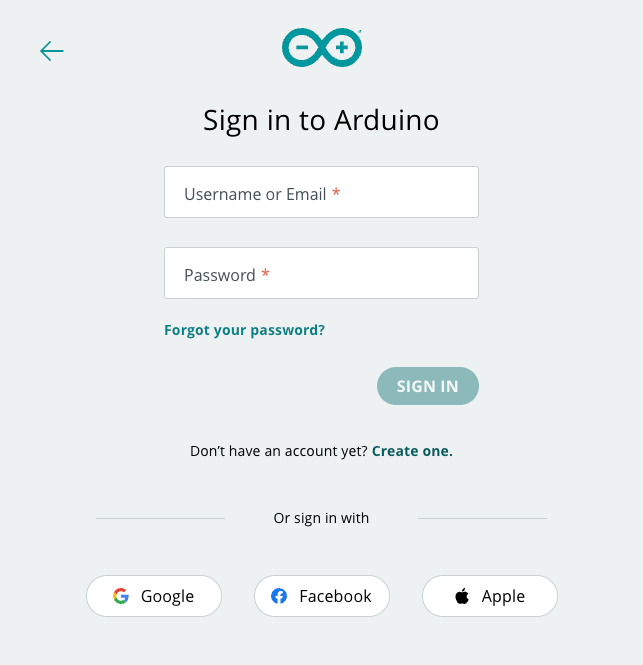
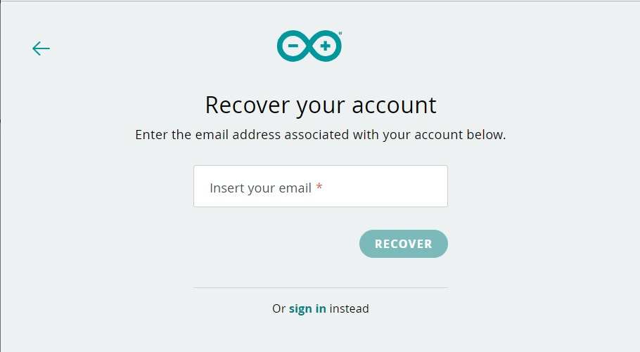

Losing your password or forgetting your username are common situations but are also easy to solve. In the following instruction we will guide you on how to recover the password or your username in case you have used an Arduino username to log in before.

In case you have used the Sign in with Google option, you need to get in contact directly with Google.

First, go to [login.arduino.cc/login](https://login.arduino.cc/login) and click on `Forgot your password?`.

Type your email in the text field.

After pressing the button you will receive an email with instructions to reset the password. In case you haven’t received the email, check your `Spam folder`.
