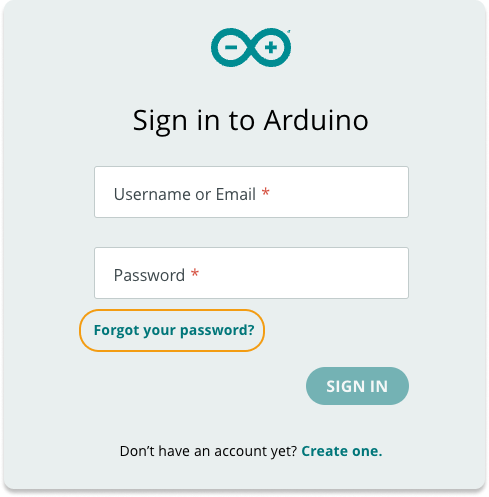

Learn how to reset the password for your Arduino account. If you have Two-factor authentication enabled, see [this article](https://support.arduino.cc/hc/en-us/articles/360022029299-I-lost-access-to-my-2-factor-authentication-app-how-do-I-log-in-to-my-Arduino-account) instead.

If you signed in using Google, Facebook, Apple, or GitHub and forgot your password, please reach out to the support team of the respective company for assistance.

---

## Reset the password for your account

Follow these steps:

1. Go to [login.arduino.cc/login](https://login.arduino.cc/login).

2. Click on **Forgot your password?**

   

3. Type in the email for your Arduino account and click **Recover**

4. Open your email inbox and look for an email from **auth** (auth@arduino.cc) with the subject "Reset your password".

5. Follow the instructions in the email to set a new password.

## If you can't find the email

Check the following:

* Make sure you're checking the right email inbox.
* Check the spam folder.

If you still have problems, please [contact us](https://www.arduino.cc/en/contact-us/) using the email for the Arduino account.
