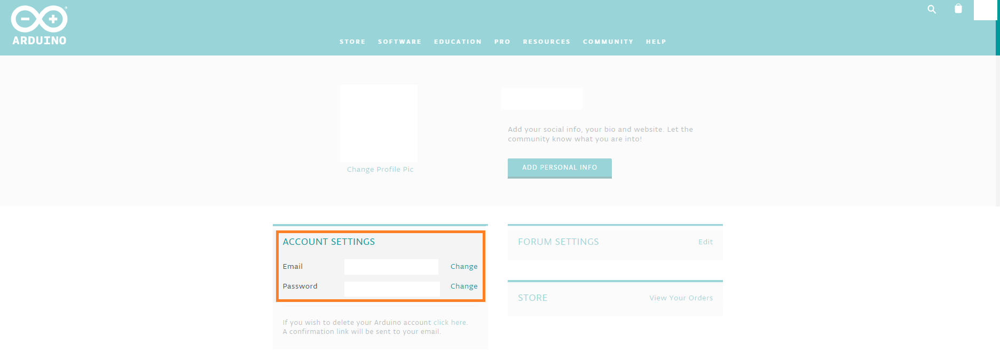

The Arduino email account can be changed from one email address to the another email address. Please make sure that, you are not logged-in with a *Sign in with Google* option from the Arduino [log in](https://id.arduino.cc) page.

Below are the guidelines to change the email address of the Arduino account:

1. Go to [arduino.cc](https://www.arduino.cc/) and sign-in to your Arduino account.
  

2. Click on your profile icon on the top right corner and select the profile sub-section.
  

3. You can change the email address from the change option as shown in the picture below.
  
