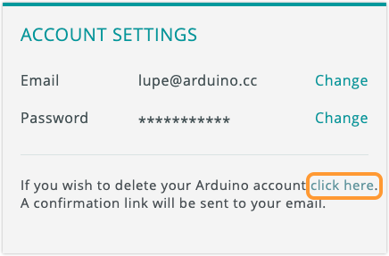

You can delete your Arduino account at any time. Learn what you should know before deleting your Arduino account, and how to requesst account deletion.

In this article:

* [About account deletion](#about-account-deletion)
* [Before you delete your Arduino account](#before-you-delete-your-account)
* [Deleting your Arduino account](#delete-account)
* [Requesting forum account anonymization](#forum-account-anonymization)

---

## About account deletion

* After you submit an account deletion request, it is possible to sign up for a new acccount using the same email.
* After receiving the account deletion request, Arduino will retain your data for an additional seven days. During this time your username may still appear in the Arduino Forum and Project Hub. After seven days, your data is automatically deleted.
* In the Arduino Forum and Arduino Project Hub, your account activity will be _anonymized_. When an account is anonymized, the associated username and user profile are deleted from the system. However, forum posts and project descriptions can still include mentions of your username or other personally identifiable information.

---

## Before you delete your account

Before you delete your account, check the following:

* [Review the Cloud Editor sketchbook](https://docs.arduino.cc/software/web-editor/arduino-web-editor-secondary-features#the-sketchbook-tab), and download any sketches you want to keep.

* [Export historical data from Arduino Cloud](https://support.arduino.cc/hc/en-us/articles/8825464267420) that you want to keep.

* Review your [shared dashboards in Arduino Cloud](https://docs.arduino.cc/arduino-cloud/features/sharing-dashboards). Dashboards that you've shared with other users will still be available after you delete your account, but any widgets connected to your Things will no longer work.

* [Review any active subscriptions](https://support.arduino.cc/hc/en-us/articles/4401881299090-Review-change-or-cancel-an-Arduino-Cloud-plan). When you delete your Arduino account, subscriptions are canceled at the end of their billing cycles.

* Review your post history in the [Arduino Forum](https://forum.arduino.cc/). When your account is deleted, your username will no longer be displayed, but the posts themselves can still contain personally identifiable information. Remove information that you don't want to appear after your account has been deleted.

* Review your projects on [Arduino Project Hub](https://projecthub.arduino.cc/). Remove any personally identifiable information from the project description, code, or downloadable files, or delete the associated project entirely. When your account is deleted, your user profile will be removed. Projects that you keep will stay public, but will be credited to "Anonymous User" instead.

* Sign in to [id.arduino.cc](https://id.arduino.cc/) and check if any junior accounts are connected to your account. When you delete your account, any junior accounts that you created will also be removed.

If you have questions about what happens when you delete your account, please [contact us](https://www.arduino.cc/en/contact-us/) first.

---

## Deleting your account

You can request account deletion on Arduino's main website, or inside the Science Journal app.

### On arduino<!-- nolink-->.cc

Follow these steps to delete your account:

1. Sign in to <a class="link-external" href="https://id.arduino.cc/">id.arduino.cc</a>.

2. Under **Account Settings**, find the text "If you wish to delete your Arduino account click here". Click on **"click here"**.

   

3. Open the email associated with your Arduino account and look for an email from noreply<!-- nolink-->@arduino.cc.

4. Click the confirmation link to confirm the deletion of your account.

### In the Science Journal app

Follow these steps to delete your account:

1. Open the sidebar menu.

2. Tap **Advanced Settings**.

3. Tap **Delete Account** and tap again to confirm.

4. Open the email associated with your Arduino account and look for an email from noreply<!-- nolink-->@arduino.cc.

5. Click the confirmation link to confirm the deletion of your account.
