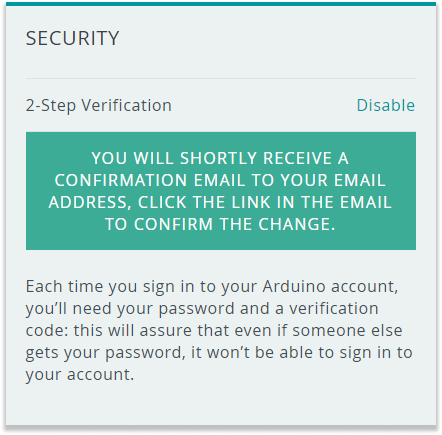
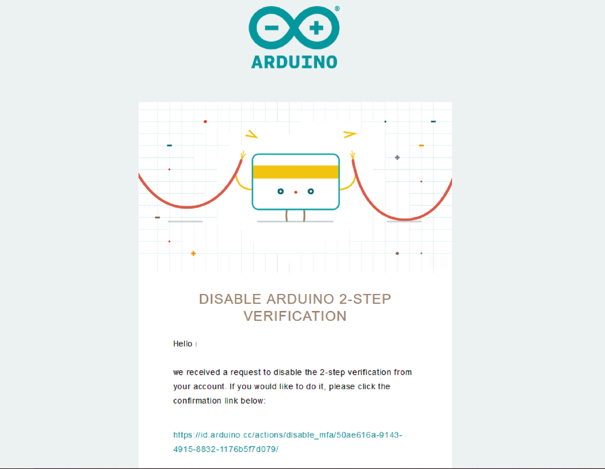

If you need to change your mobile device or perform a factory reset, you can disable 2-Step Verification for your Arduino account.

## Disable the 2-Step Verification

1. Go to your [Arduino account profile](https://id.arduino.cc/)

2. Click on 'Disable' under the Security section. A message will be displayed stating that you will receive an email. It will send the email to the address listed in the account settings section.

   

3. Check your email for a message with the subject 'Disable Arduino 2-step verification'. Click the link.

   

4. After clicking on the link, 2-step verification will be disabled.

   
