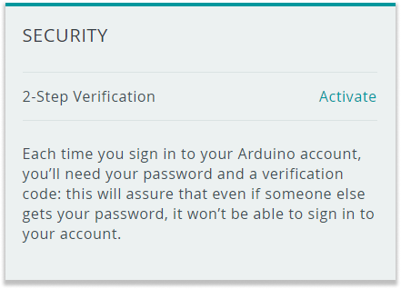
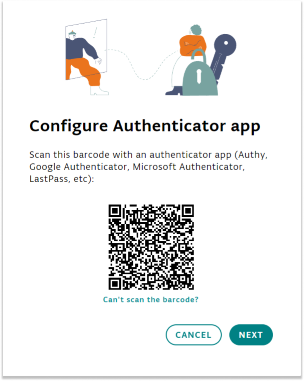
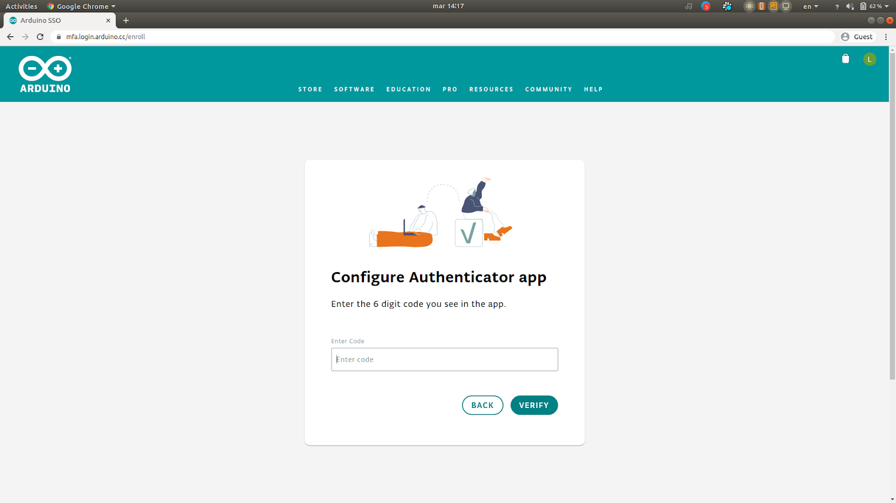
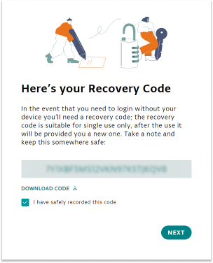

Securing your Arduino account is crucial to protect your projects and personal information. Enabling 2-Step Verification adds an extra layer of security, requiring both your password and a code generated by an authenticator app to access your account.

Arduino supports 2-step Verification via authenticator software such as _Authy_, _Google Authenticator_, _Microsoft Authenticator_ or similar.

---

1. Log in to your account, go to [your profile](https://id.arduino.cc/),

1. In the Security Section, click on **Activate**

   

1. Open your preferred authenticator app (e.g., Authy, Google Authenticator, Microsoft Authenticator).

1. A window will display a QR code. This code is used to configure your account with an authenticator app.

   

   Add a new account in the authenticator app and scan the QR code displayed in the window and click **Next**.

1. Your authenticator app will generate a **six-digit code** that changes every 30 seconds. Enter this code into the text field in the window and click **Verify**.

   

1. The window will now display a **Recovery Code**. Save this code in a secure location.

   

   You will need the recovery code if you lose access to your 2FA app, such as if your phone is lost or broken.

   > [!IMPORTANT]
   > If you lose access to both your 2FA app and the recovery code, you will not be able to access your Arduino account, and Arduino support will be unable to assist you.

1. Enter the code from your 2FA app one more time to complete the setup.

1. Once all this is set, you are good to go! You have now the 2-Step Verification enabled on your Arduino account.
