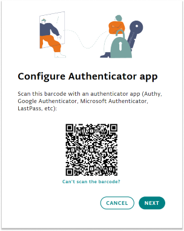
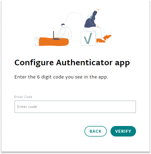

Arduino supports two-factor authentication via authenticator software as *Authy*, *Google Authenticator*, *Microsoft Authenticator* or similar. To enable 2FA on your account:

1. Log in to your account, go to [your profile](https://id.arduino.cc/), then in the Security Section click on `Activate`:

   

2. In the window, you will be shown a QR code to be sed to configure your account log-in in your authentication app.

   

3. Download or open your preferred authenticator app, navigate to the option where you can add a new log in to be used, and scan the QR code.

   Click `Next` in the Arduino account window.

4. The app will now show you a `six-digit code` that changes every 30 seconds, copy this number in the text field from the Arduino window and click `Verify`.

   

   In the Arduino window you will now be provided a **Recovery Code**. It is very important that you save it in a safe place.

   

   You will need it in case you lose your 2 factor authentication app access (for example, if you misplace or break your phone).

   If you lose both the access to the 2 factor authentication app and the recovery code, you will no longer be able to access your account, and we in Arduino will not be able to help you.

5. Once all this is set, you are good to go! You have now the Two-Factor Authentication enabled on your Arduino account.

   
