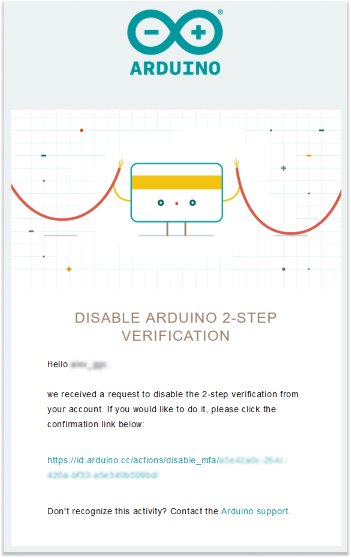

If you come up with a situation where you have the necessity to change your mobile or doing a factory reset on mobile etc., then you can disable your 2 step authentication for the Arduino account.

It is always recommended to save your one-time recovery code while activating the security of 2 step authentication on Arduino account.

## Steps

1. First, go to [arduino.cc](https://www.arduino.cc/) website and click `SIGN IN` on the top right corner icon if you haven't done so yet.

2. Once you are signed in, click on the top right of the signed-in account icon and select the `PROFILE` tab.

   

3. Click on `DISABLE` to deactivate your 2 step authentication security from the Arduino account.

   

4. For the security confirmation, we will send you a email with the Arduino two factor authentication deactivation link.

   

5. After clicking on this link, your Arduino account 2 factor authentication security is disabled.

   
