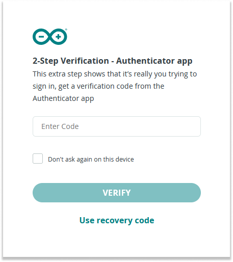
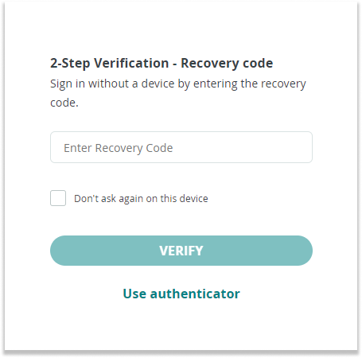
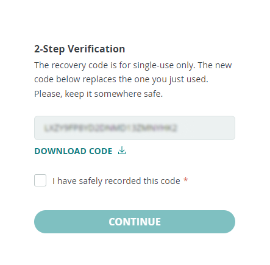

When you enable 2-Step Verification on your Arduino account, you're given a 24-digit recovery code. This code is crucial for accessing your account if you lose your verification app.

## How to locate your recovery code

If you downloaded the file when you received your recovery code, it should be named 'Arduino 2-step verification recovery code'.

The easiest way to find your recovery code file is by searching for it across your computer.

**Windows:**

1. Open File Explorer by clicking the folder icon on your taskbar or press `Windows + E`.

1. In the left sidebar, select **This PC** to search your entire computer.

1. Type **Arduino 2 step verification recovery code** in the search box in the upper right corner of the File Explorer window and press Enter.

1. Wait for Windows to complete the search and display the results.

**Mac:**

1. Click on the Spotlight icon (a magnifying glass) in the upper-right corner of your screen or press `Command + Space`.

1. Type **Arduino 2 step verification recovery code**.

1. Spotlight will display a list of matching files from your entire Mac.

## How do I use my recovery code?

1. Log into your Arduino account.

1. When prompted for 2-Step Verification, click 'Use recovery code'.

   

1. Enter your recovery code in the provided field.

   

1. Save your new recovery code in a safe place.

   

1. Check the box confirming 'I have safely recorded this code'.

1. Now that you've logged in, you should reset the 2-step verification by [removing the old connection](https://support.arduino.cc/hc/en-us/articles/360016759779) and [adding a new one](https://support.arduino.cc/hc/en-us/articles/360018131120).

## What should I do if I can't find my recovery code?

If you can't find your recovery code, you must create a new account, as your previous one will no longer be accessible. We do not have any means to provide a new code or access to the old account.
