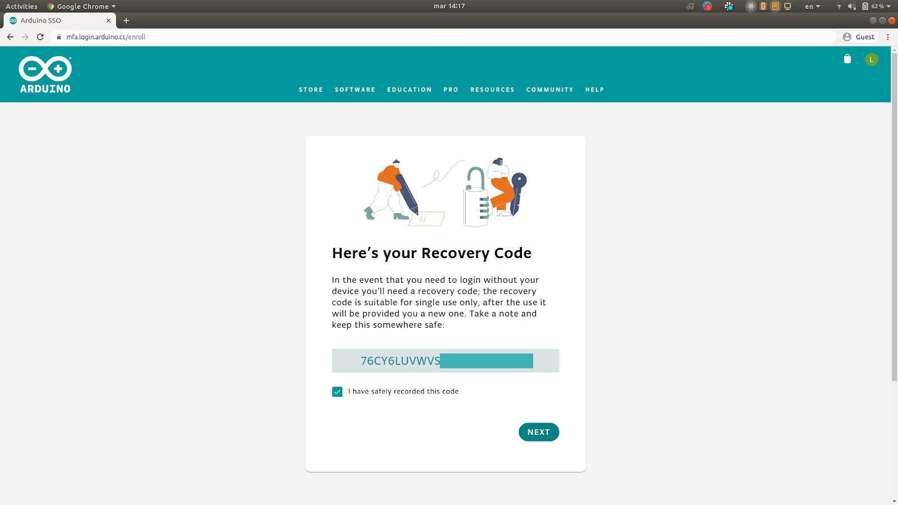

When you first enable 2 factor authentication on your Arduino account, a single use, 24 digit, `Recovery code` will be provided. This code needs to be saved, since if you were to lose your 2 factor authentication app (e.g. you misplace or break your phone) you will need it to log in to your account.

If you do not know your recovery code, you will need to create a new account and your previous one will no longer be accessible. We do not have any means to provide a new code nor access to said account.

