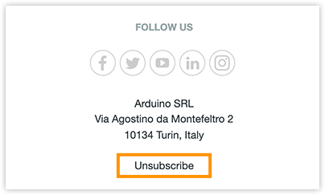

Learn how to subscribe or unsubscribe from the Arduino newsletter.

## Subscribe or unsubscribe from your profile page

1. Go to [id.arduino.cc](https://id.arduino.cc/) and sign in.

2. Scroll down and find the _Privacy Settings_ category.

3. Check or uncheck the _I confirm my consent to receive your newsletter_ option.

## Unsubscribe from an email

1. Open a newsletter and scroll down to the bottom.

2. Find and open the _Unsubscribe_ link.

   
