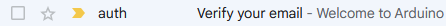

After completing the registration process, you should automatically receive a confirmation email in your inbox. It's an important step to finalize your account setup. If for some reason you haven't received the confirmation email, follow these steps to resend the email and complete the verification process.

## Re-send Verification Email

1. Sign in to your [Arduino account](https://www.arduino.cc/) in the top right corner.

1. Look for a dialog box at the bottom of the screen. Press **Resend email**

    

1. The email sent out should have a title similar to the one depicted below.

    

    In the email, you'll find a button labeled **Confirm Now**. Click it to complete the verification process.

1. Everything should now function as intended, and your account should be successfully verified.

## If you haven't received the confirmation email

If you still haven't received the confirmation email, please escalate your case to the Arduino [support](https://www.arduino.cc/en/contact-us) team.
