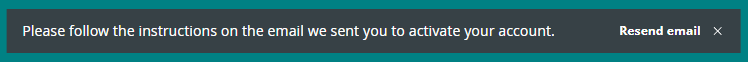

After completing the registration process, you should automatically receive a confirmation email in your inbox. It's an important step to finalize your account setup. If for some reason you haven't received the confirmation email, follow these steps to resend the email and complete the verification process.

---

## Resend the verification email

Follow these steps:

1. Sign into [id.arduino.cc](https://id.arduino.cc/).

1. Look for a dialog box at the bottom of the screen with the text "Please follow the instructions on the email we sent you to activate your account". Click **Resend email**

    

1. Open your email inbox and look for an email from **auth@arduino.cc** with the subject "Verify your email".

1. Open the email and click the **Confirm Now** button to complete the account registration.

## If you haven't received the verification email

Follow these steps:

1. Make sure you're checking the correct email inbox.

2. Check your spam folder.

3. [Contact us](https://www.arduino.cc/en/contact-us) for further assistance.
