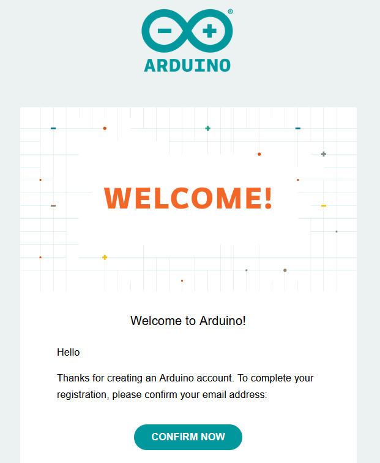

After completing the registration process, you should automatically receive a confirmation email in your inbox. It's an important step to finalize your account setup. If for some reason you haven't received the confirmation email, follow these steps to resend the email and complete the verification process.

If you've just created your account, please check your spam folder. Additionally, try searching for the email. It typically appears like this:

## Re-send Verification Email

If the link doesn't work or if you're unable to locate the email, please follow these steps:

1. Log into your [Arduino account](https://www.arduino.cc/) in the top right corner.

1. Upon receiving the email, you'll find a button labeled `Confirm Now`.

    

1. Once you've clicked on the `Confirm Now` button, everything should function as intended, and your account will be successfully verified.

---

If you still haven't received the confirmation email, please escalate your case to the Arduino [support](https://www.arduino.cc/en/contact-us) team.
