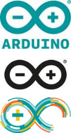
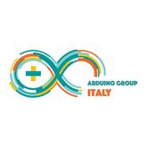
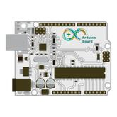

This page covers the basic trademark rules you must follow when using the Arduino Logo and the Community Logo. Please note that Arduino’s general Intellectual Property terms and conditions can be found [here](https://www.arduino.cc/en/trademark).

## Arduino Logo

 

The Arduino Logo is a registered trademark of Arduino SA, which means that it cannot be used by third parties without the trademark owner’s authorization. As you can see, the Arduino Logo comes in different colors. Sometimes it is accompanied by the word mark "Arduino", other times it is on its own. Generally speaking, the Arduino Logo (with or without the word "Arduino") cannot be used to **identify** or **advertise** third-party products and/or services; this includes compatible products (link to page), publications (link to page) and online content.

An exception to this rule is when the Arduino Logo is used in a **descriptive** or **explanatory** way: for example, the Arduino logo may be used in a text that explains what Arduino is. Even modified/customized versions of the Arduino Logo are considered trademark violations. In the table below we show some examples of correct and incorrect uses of our logos. The examples are for illustrative purposes.

## Community Logo

The Arduino Community Logo (download it [here](https://www.arduino.cc/en/trademark/community-logo)) has been developed by Arduino to give users a chance to identify non-commercial pages, groups, events, and initiatives connected to Arduino. The Arduino Community Logo can be used on social media community pages and groups, to identify services and activities with **no commercial purposes**, such as free events or free publications, courses, and workshops. Please note that “non-commercial” means any use or activity where a fee is not charged and the purpose is not the sale of a good or service, and the use or activity is not intended to produce a profit.

The Arduino Community Logo cannot be used on products or services that are sold commercially and in no case on electronic boards (also non-commercial). The Arduino Community Logo is shared with an Attribution-NonCommercial-ShareAlike 3.0 Unported (CC BY-NC-SA 3.0) license. It is designed to allow personalization in the lower-right part to provide a free space on which to add the name of your group or organization. Apart from that, the community logo should not be altered, cropped, shortened, or modified in any way. It is not allowed to incorporate another logo, trademark, or commercial company name into the Community Logo.

## Do's and Dont's

| Issue | Do | Don't|
| ----------- | ----------- | ----------- |
| Facebook group for Arduino enthusiasts |  | 
| Free online tutorial | | |
| Banner advertising a free maker convention | | |
|Facebook Marketplace posts selling compatible products |  |  |
| Compatible boards |  |  |
| Customization  |  |  |
