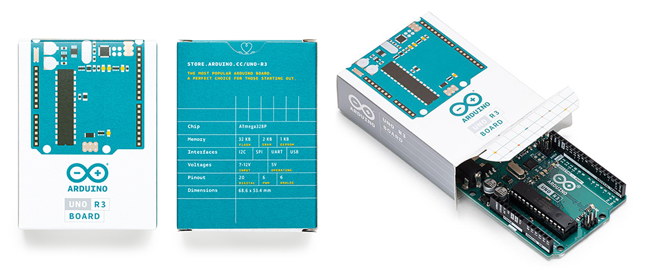
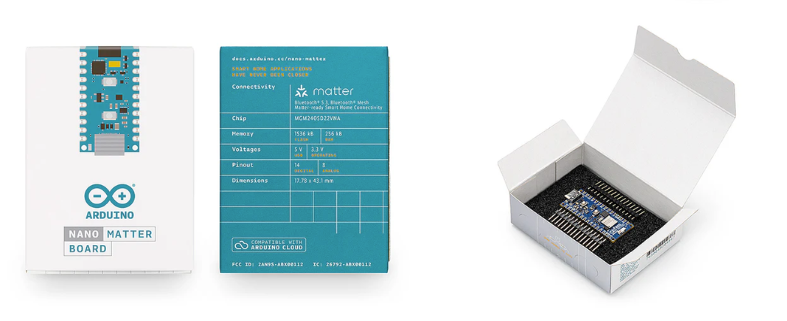
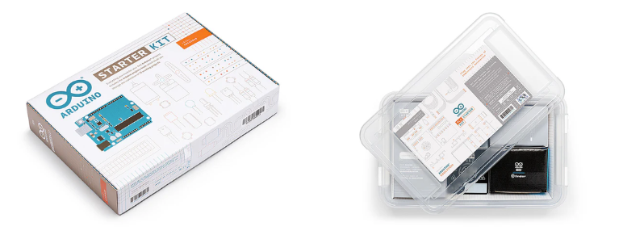

This article covers the issue of counterfeit boards – how to identify them and warning signs to look out for in stores. Let us first differentiate between compatible and counterfeit boards.

* **Compatible:** When a third-party product has copied the open-source hardware design and uses its own brand name. No problem!
* **Counterfeit:** When a third-party product uses the Arduino name and/or logo directly on the product, or in the store, to deceive customers. Not cool!

> [!NOTE]
> It is fine for compatible brands to *reference* Arduino, in order for their customers to easily identify what type of product it is. Read more about trademark use in relation to compatible products [here](https://support.arduino.cc/hc/en-us/articles/4677964202908-Trademark-guide-for-compatible-products?_gl=1*eqme6q*_up*MQ..*_ga*MTk3NzU3MjcxOC4xNzQyOTc3ODcx*_ga_NEXN8H46L5*MTc0Mjk3Nzg3MS4xLjEuMTc0Mjk3Nzg3Ny4wLjAuODM4OTIxNDg2).

## Table of contents

1. [Pricing](#pricing)
2. [Naming and descriptions](#naming-and-descriptions)
3. [Product photos](#product-photos)
4. [Packaging](#packaging)
5. [Color and silkscreen](#color-and-silkscreen)
6. [Logos and fonts](#logos-and-fonts)
7. [Why buy original Arduino products?](#why-buy-original-arduino-products)

The tips below are intended for you as a customer, whether you have already bought or are planning on buying an Arduino product. By reading the contents of this article, you will be able to find out if an Arduino product of your interest is an original Arduino product, a compatible product, or in fact a counterfeit.

> [!NOTE]
> There are three trusted ways of buying an original Arduino product:
>
> * via **[Arduino Store](https://store.arduino.cc/)**: even if you’re not shopping there, you can use it as a reference for product names, colors, and prices,
> * via Arduino’s official **[Amazon storefront](https://www.amazon.com/stores/Arduino/page/E4CD2702-3533-4B57-8BE2-6786AA74DC08?ref_=ast_bln&store_ref=bl_ast_dp_brandLogo_sto)**,
> * via an **authorized reseller** of Arduino products, the list is available [here](https://store.arduino.cc/pages/distributors?srsltid=AfmBOoqsTcAm6WJViIrV49PnUJcVt3zQ2cxOoA8UbE0c_B-e4VhKmleN).

Below you will find the main indicators of original and non-original Arduino products.

## Pricing

Significant price differences between the official Arduino store and another seller might indicate a product is a counterfeit or a compatible board and **not** an official Arduino product.

## Naming and descriptions

Look out for phrases like “clone” or “for Arduino”. These phrases are normally used to identify non-Arduino boards and components. They can be compatible boards and not counterfeits, but they are **not** original Arduino products.

## Product photos

* Photos of one product depict several products instead.
* Photos are angled or blurry to conceal details.
* Listing photos do not match customer review photos.

## Packaging

### Boards

* Individually sold Arduino boards come packaged in a compact, well-made cardboard box.
  * The top side should have a graphic of the board.
  * The bottom side should list technical specifications for the board.

* Counterfeits may come packaged in cheaper and generic packaging, like a plastic antistatic bag or zipper bag.

### Kits

* Official Arduino kits come in well-made branded cardboard or hard plastic boxes, see examples below.

* Counterfeit kits may come packaged in cheaper packaging with each component coming in a plastic antistatic bag.

## Color and silkscreen

The silkscreen is a layer of ink trace that contains logos, symbols, and text used to identify components. It also provides the board with a background color. Below you can find a breakdown of the original silk colors for our most popular products. Any other silk color may indicate a counterfeit. Please refer to the [Arduino Store](https://store.arduino.cc/) to see the correct silk color for a board you are planning on purchasing.

Board            | Front                                                                                        | Back
---              | ---                                                                                          | ---
UNO R3           |             | 
UNO R4 Minima    |     | 
UNO R4 WiFi      |       | 
Nano             |               | 
Due              |                   | 
Nano 33 BLE Rev2 |  | 
Nano ESP32       |        | 
Pro products     |      | 

## Logos and fonts

* Logo:
  * Original boards have the registered mark (®) next to the logo,
  * Counterfeits often use the trademark symbol (™) next to the logo,
* Quality:
  * Original boards have high quality print with well-defined letters,
  * Counterfeits have lower quality, e.g. the first letter in “Arduino” is often “filled in” due to poor quality control,
* Fonts:
  * Original boards use the same font for all text on the board,
  * Counterfeits use different fonts on the same board.

<table class="img-captions">
  <tr>
    <td></td>
    <td></td>
    <td></td>
  </tr>
  <tr>
    <td>Original board</td>
    <td>Counterfeit</td>
    <td>Counterfeit</td>
  </tr>
</table>

When you carefully observe the font in which "Arduino" is written you can find a difference between the original and counterfeits. Counterfeits tend to overlook or not be able to reproduce the same quality.

<table class="img-captions">
  <tr>
    <td></td>
  </tr>
  <tr>
    <td>Counterfeit board with varying fonts.</td>
  </tr>
</table>

## Why buy original Arduino products?

Please note that purchasing an official Arduino product will support:

* Developing new open-source hardware
* Producing documentation
* CE/FCC certification
* Carbon offsetting
* Quality control
* Community management
* Publishing tutorials
* Making donations to other open-source projects
* Hosting and maintaining websites and forums for millions of users

Remember that technical support is provided **only** for official Arduino products.
