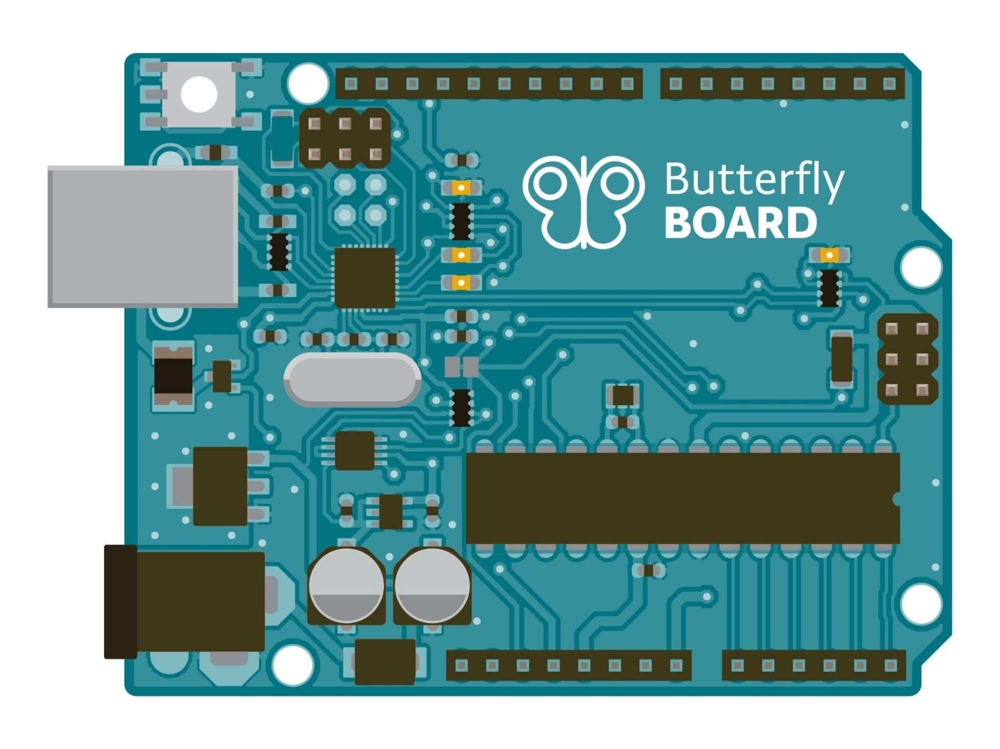
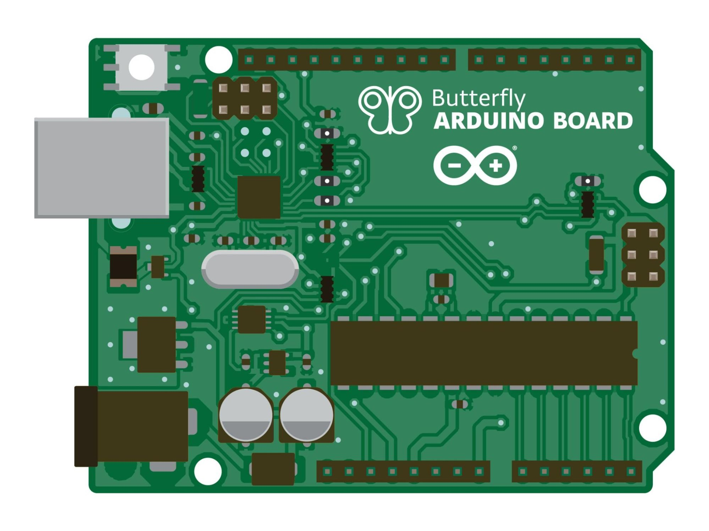
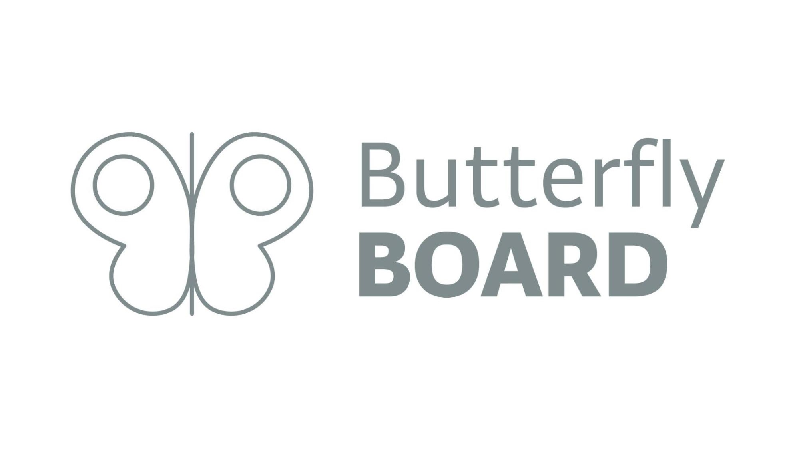
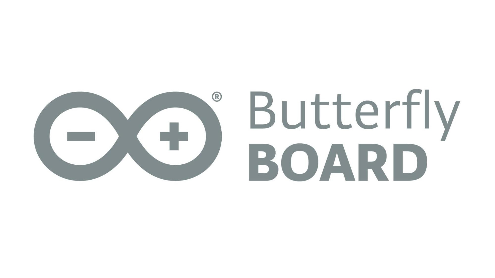
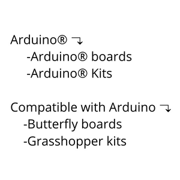
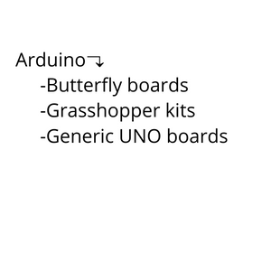

This guide covers the basic trademark rules you must follow when developing products based on, or compatible with, Arduino. By following these guidelines, you will be able to develop, share, and even commercialize your products without violating Arduino’s Intellectual Property. Please note that Arduino’s general Intellectual Property terms and conditions can be found [here](https://www.arduino.cc/en/trademark).

**A compatible product can be:**

1. A product, such as a board, derived from an Arduino board and compatible with the Arduino IDE.

2. Any device, developed by a third party, that contains an Arduino board.

A compatible product can have its own brand or be unbranded. Compatible products are perfectly legal to make, use, and sell, as long as they don’t violate any of Arduino’s trademarks.

## Open-source and compatible products

Most hardware designs of Arduino are open source, which means that copying and further developing these designs is allowed. However, the **Arduino trademark** is protected:

- It is **not allowed** to print the word Arduino or the Arduino logo on the board. Manufacturing and selling counterfeits is illegal.

- It is **not allowed** to call your compatible product “Arduino”, even if you copied the design from Arduino. Your finished product is a product compatible with Arduino which should have its own name and brand.

## Logo

If you want your compatible product to carry a logotype, you should develop your own. Your logo should be clearly distinguishable from the Arduino logo, even if your product is derived from Arduino technology.

You are **not allowed** to use the Arduino logo in connection with the compatible product you have developed. This includes:

- Printing the logo on the product

- Printing the logo on the packaging

- Printing the logo on any promotional material advertising your product including social media.

Modified versions of the Arduino logo are also considered trademark violations.

## Name

Understandably, compatible brands want to refer Arduino®, for customers to easily identify what type of product it is. If you want to indicate that your product is compatible with Arduino, you should use the correct phrasing, such as: “Compatible with Arduino” “For Arduino” or “Based on Arduino”. **Always place the word Arduino last.**

Please note that even if you are using a genuine Arduino board as part of your project, the final product **cannot be called “Arduino”.** If your product includes an original Arduino board, make sure to name it correctly. Example: “Butterfly Robot with Arduino® Nano 33 BLE”.

The Arduino name **cannot be included** in a company name even if the company uses the same technology as Arduino. This includes domain names too.

## Do's and Dont's

| Issue | Do | Don't|
| ----------- | ----------- | ----------- |
| Product |  | |
| Product Name | Butterfly Board  - compatible with Arduino | Butterfly Arduino Board |
| Product Name | Ladybird Shield for Arduino | Arduino Ladybird Shield |
| Product Name | Grasshopper Starter Kit based on Arduino | Grasshopper Arduino Starter Kit |
| Logo |  |  |
| Product Category |  |  |
| Website Name | www.butterfly.com | www.butterflyarduino.com |
