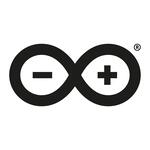

This article covers the basic trademark rules that must be followed when using the [Arduino Logo](#arduino-logo) and the [Community Logo](#community-logo).

---

<h2 id="arduino-logo">Arduino Logo</h2>

The Arduino logo can be found in the following colors:

 

 > The logo can sometimes be accompanied by the word mark *Arduino* or appear on its own.

The Arduino logo is a registered trademark and cannot be used by third parties without the trademark owner’s authorization. Generally speaking, you **cannot** use the Arduino Logo (with or without the word *Arduino*) to identify or advertise your products and/or services. This includes:

* Compatible products <!-- link to Compatible products section-->
* Publications <!-- link to Courses, workshops and publications section-->
* Online content.

> There is an exception to this rule if the Arduino Logo is used in a descriptive or explanatory way. For example, the Arduino Logo may be used within a text explaining what Arduino is.

Please be aware that even modified/customized versions of the Arduino Logo are considered trademark violations.

* [See examples](#examples) of correct and incorrect uses of Arduino logos. Note that the examples are for illustrative purposes.

<h2 id="community-logo">Community Logo</h2>

The Arduino Community Logo ([download here](https://www.arduino.cc/en/Trademark/CommunityLogo)) has been developed by Arduino for users to identify non-commercial pages, groups, events, and initiatives related to Arduino.

> 

The Arduino Community Logo can be used freely on, for example:

* Social media community pages and groups, and to identify not-for-profit activities

* Non commercial publications, courses and workshops. (e.g. when developing a not for profit video tutorial about Arduino, the Community Logo can be used in connection to it)

The Arduino Community Logo **cannot** be used on:

* Products or services that are sold commercially

* Electronic boards (including non-commercial)

**Note**: the Arduino Community Logo is shared with a [Attribution-NonCommercial-ShareAlike 3.0 Unported (CC BY-NC-SA 3.0) license](https://creativecommons.org/licenses/by-nc-sa/3.0/). It is designed to allow personalization in the lower-right part in order to provide a free space on which to add the name of your group or organization. Apart from that, the community logo should not be altered, cropped, shortened, or modified in any way. It is not allowed to incorporate another logo, trademark, or commercial company name into the Community Logo.

<h2 id="examples">Examples</h2>

<table>
  <tr>
    <th>Issue</th>
    <th>Do</th>
    <th>Don't</th>
  </tr>
  <tr>
    <td>Facebook group for Arduino enthusiasts</td>
    <td></td>
    <td></td>
  </tr>
  <tr>
    <td>Free online tutorial </td>
    <td></td>
    <td></td>
  </tr>
  <tr>
    <td>Banner advertising a free maker convention </td>
    <td></td>
    <td></td>
  </tr>
  <tr>
    <td>Facebook Marketplace posts selling compatible products  </td>
    <td></td>
    <td></td>
  </tr>
  <tr>
    <td>Compatible boards </td>
    <td></td>
    <td></td>
  </tr>
  <tr>
    <td>Customization </td>
    <td></td>
    <td></td>
  </tr>
</table>
