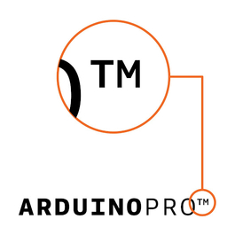
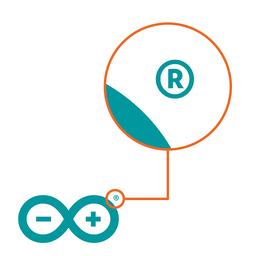

A trademark is a word or symbol representing a company or product. It is used to identify a specific source of goods or services and protect that source from confusion with other sources. Trademarks are recognizable by the symbols ™ or ®.

> 

Most hardware designs of Arduino are open-source, but the company's name and logos are not. Copying and further developing Arduino's open-source products into their own thing is allowed, as long as the name Arduino, the infinity logotype, and other trademarks are respected.

Arduino's trademark portfolio includes other trademarks that may apply differently depending on geographic region.

> Please check national trademark search engines or [contact us](trademark@arduino.cc) if you are uncertain of what trademark applies in your region.

## Counterfeit products

One of the reasons for having trademarks is to protect customers from counterfeit products. These may look like Arduino products, but they are not manufactured by Arduino.

* See [how to spot a counterfeit](https://support.arduino.cc/hc/en-us/articles/360020652100-How-to-spot-a-counterfeit-Arduino)

## More information

Visit [Trademark & Copyright](https://www.arduino.cc/en/trademark) for more information and a comprehensive list of rules regarding Arduino’s trademarks.
