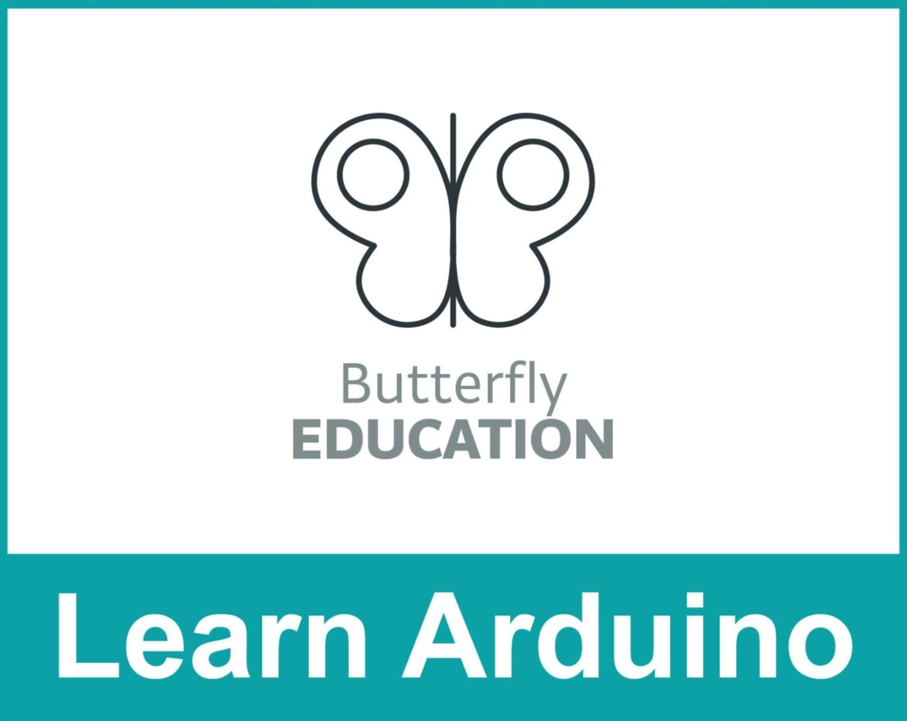

This guide covers the basic trademark rules you must follow when developing a course, workshop, or tutorial based on Arduino (Examples include but are not limited to: video tutorials, free or paid online courses, and in-person workshops). By following these guidelines, you will be able to develop, share, and even commercialize your content without violating Arduino’s Intellectual Property.

Please note that Arduino’s general Intellectual Property terms and conditions can be found [here](https://www.arduino.cc/en/trademark)

---

## Logo

You are not allowed to use the Arduino logo to identify or advertise your course, workshop, or tutorial. Using the Arduino logo to draw attention to your content is a trademark violation.

You may use the logo in your course material only when it is needed for explanatory and/or descriptive purposes.
If the content you are developing is not for profit (free for users, and you do not get any direct or indirect income from it, for example through affiliate links), you are allowed to use the [Arduino Community logo](https://www.arduino.cc/en/trademark/community-logo).

Please keep in mind that if you are planning to release a certificate that mentions Arduino as a learning objective, you are **not allowed to use the Arduino logo** on it. This would imply that the certificate has been recognized by Arduino, which is not the case, and it constitutes trademark violation.

## Name

You may include the word Arduino in the title of your course, workshop or tutorial if you use it descriptively.
To avoid violating Arduino trademarks, you must name your course in a way that **does not suggest** it is officially endorsed, approved, or certified by Arduino.

## Licenses and fees

You do not have to ask us for permission or pay any license or royalty fees to develop and commercialize your content.

## Content

You are allowed to use screenshots of Arduino IDE and images of Arduino products in your course content, provided that you mention its source.
All editorial content on our website, including text and images, is distributed under Creative Commons license. This means you can use them on your own derived works, in part or completely, as long as you also adopt the same license. You find the complete text of the license here (link).
If your content includes the use of components (for example, if you develop a video tutorial), you are free to use whichever brand you choose. In other words, you do not have to use original Arduino products. However, you must provide correct descriptions of the components you use. If you are using a compatible board, you may not call it “Arduino”.

## Trademark Acknowledgments

All uses of the trademarks of Arduino SA should include an acknowledgment (for example: “Arduino® is a trademark of Arduino SA”). Please note that you should also include the registered trademark symbol the first time Arduino is mentioned in text: ARDUINO® or Arduino®.

## Do's and Dont's

| Issue | Do | Don't|
| ----------- | ----------- | ----------- |
| Name | “Basic Tutorial for Arduino” | “Arduino Basic Tutorial” |
| Name | “Workshop on Arduino” | “The Arduino Workshop” |
| Name | “Beginner’s course on Arduino: Certificate of completion” | “Arduino Certificate”  |
| Logo |  |  |
| Community Logo |  |  |
