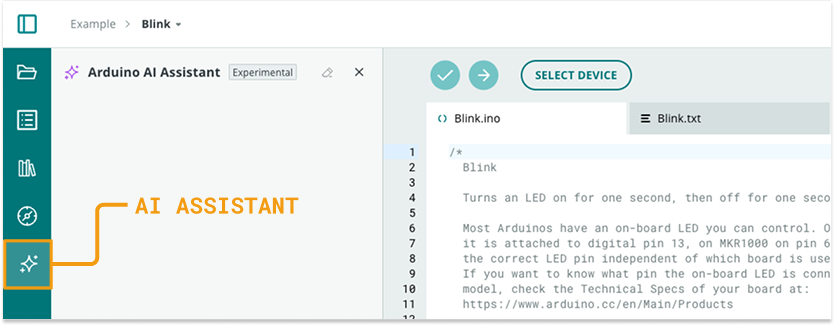

The Arduino AI Assistant is an experimental feature in the Arduino Cloud Editor, that uses Generative AI to help write code for your sketch.

In this article:

<!-- TOC -->

- [Requirements](#requirements)
- [Getting started with the Arduino assistant](#getting-started-with-the-arduino-assistant)
- [Undo an applied suggestion](#undo-an-applied-suggestion)
- [Further reading](#further-reading)

<!-- /TOC -->

## Requirements

The Arduino AI Assistant is available on all Cloud plans.

The maximum number of requests that can be sent each month depends on the Cloud plan:

| Plan               | Interactions |
|--------------------|--------------|
| Free               | 30 / month   |
| Maker              | 1500 / month |
| School             | 1500 / month |
| Team or Enterprise | Unlimited    |

To see all the options, check out cloud.arduino.cc/plans.

## Getting started with the Arduino assistant

Follow these steps:

1. Go to [app.arduino.cc/sketches](https://app.arduino.cc/sketches).

1. Choose a sketch to open in the Cloud Editor:

    - **Create a new sketch:** Click on the Create button in the top-right corner and choose New Sketch.
    - **Open a saved sketch:** Click on a sketch you want to open.

1. Select the AI assistant tab in the sidebar:

   

1. Do one of the following to start a conversation:

   - Select a hint to send the suggested message (available when the chat history is empty).
   - Type a message into the text field and press Enter to send.

1. Arduino AI Assistant will write a response.

1. Refine or continue:

   - If the response isn’t quite right, try:

     - Rephrasing your question

     - Asking for more detail or examples

     - Saying “Try again” or “Make it shorter/longer/more casual”

   - If the response include a **code suggestion**, these actions will be available:

     - _Copy:_ Copy the suggestion to your clipboard.

     - _Apply:_ Apply the suggestion to the main sketch file.

**Prompt examples:**

- _Code generation:_ "I want to draw on the LED matrix a column of 4 LEDs that is moving from left to right over time."
- _Explanatory:_ "How does the sketch loop work in this sketch?"

## Undo an applied suggestion

To undo an applied suggestion Press <kbd>Ctrl</kbd> + <kbd>Z</kbd> (Windows/Linux) / <kbd>⌘</kbd> + <kbd>Z</kbd> (macOS) or select Edit > Undo in top menu bar.

If the Cloud Editor is closed or refreshed, previously applied suggestion cannot be undone. Please back up important sketches before applying suggestions.

## Further reading

- [Understand how the Arduino AI Assistant works and how it uses your data](https://support.arduino.cc/hc/en-us/articles/19958862731804)
