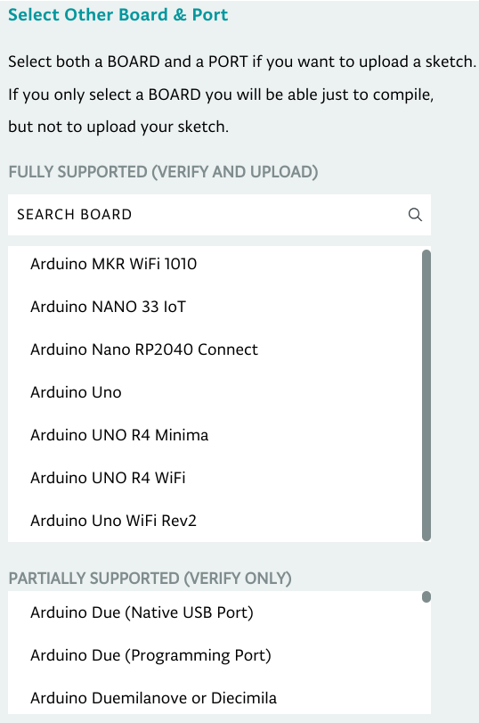
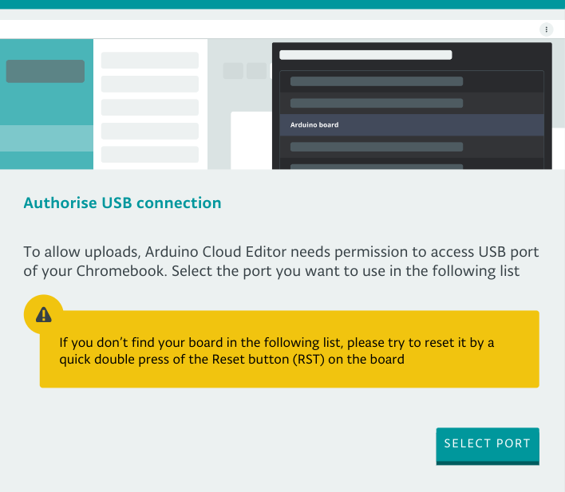
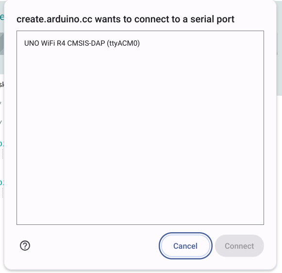

You can write and upload sketches on Chrome OS with the Cloud Editor in Arduino Cloud. The Cloud Editor has an extensive feature set similar to the desktop IDE. While many popular boards are compatible, you should check [the list of compatible boards here](https://support.arduino.cc/hc/en-us/articles/360014779899).

---

## Install Arduino Cloud for Chromebook

To use Arduino boards on Chromebook, you need to install the **Arduino Cloud for Chromebook** app. This app handles serial communication with the board, and is replacing the previous Chrome Apps[^chrome-apps].

Follow these steps to install Arduino Cloud for Chromebook:

1. Open [Arduino Cloud for Chromebook (Google Play)](https://play.google.com/store/apps/details?id=cc.arduino.create_editor){.link-external}
2. Click the **Install** button on the page.
3. Choose the device and click **Install**.
4. Find the app in the **Launcher** to open it.
5. Sign into your Arduino account

The currently supported boards include:

* Arduino UNO R4 Minima
* Arduino UNO R4 WiFi
* Arduino UNO (R3 and older revisions)
* Arduino MKR WiFi 1010
* Arduino Nano 33 IoT
* Arduino RP2040 Connect
* Arduino UNO WiFi Rev2

[Learn more about boards compatible with the Cloud Editor](https://support.arduino.cc/hc/en-us/articles/360014779899-Boards-compatible-with-the-Web-Editor){.link-chevron-right}

[^chrome-apps]: Chrome Apps are being [deprecated](https://blog.chromium.org/2020/08/changes-to-chrome-app-support-timeline.html), but are currently still available in the Chrome web store: see <a class="link-external" href="https://chrome.google.com/webstore/detail/arduino-create/dcgicpihgkmccjigalccipmjlnjopdfe">Arduino Create</a> and <a class="link-external" href="https://chrome.google.com/webstore/detail/elmgohdonjdampbcgefphnlchgocpaij">Arduino Create for Education</a>.

---

## Use the Cloud Editor on Chromebook

> [!IMPORTANT]
> The first time you use your board with Chromebook, you need to allow access to the serial port.
>
> To do this, attempt to upload a sketch (even if no port is available).

Follow these steps:

1. Begin by opening the **Arduino Cloud for Chromebook** either from the Launcher or by visiting [create.arduino.cc/editor](create.arduino.cc/editor)

1. If you're not already signed into your Arduino account, you'll be prompted to do so.

1. Next, connect a [compatible board](https://support.arduino.cc/hc/en-us/articles/360014779899#chromebook) to one of the USB ports on your Chromebook.

1. In the board selector menu, choose **Select Other Board & Port**

   

1. Pick the specific board you're using and press **OK**.

   

1. Click the **Upload** button  in the editor.

1. That should open a **Authorise USB connection** window. Click **Select port**. 

   

1. A **ChromeOS** window should appear. Select the desired port and click **Connect**.

   

Learn more about the Cloud Editor:

* [Cloud Editor in Arduino Docs](https://docs.arduino.cc/arduino-cloud/guides/cloud-editor)
