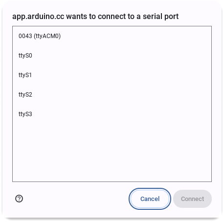

Learn how to write and upload Arduino sketches on Chromebooks running ChromeOS.

In this article:

* [About Arduino on Chromebook](#about-arduino-on-chromebook)
* [Optional: Install the Arduino Cloud for Chromebook App](#install-arduino-cloud-for-chromebook-app)
* [Use the Arduino Cloud Editor on Chromebook](#use-the-cloud-editor)

---

## About Arduino on Chromebook {#about-arduino-on-chromebook}

You can create and upload sketches on ChromeOS using the Arduino Cloud Editor.

The following boards are supported when using the Cloud Editor on ChromeOS:

* Arduino UNO R4 Minima
* Arduino UNO R4 WiFi
* Arduino UNO (R3 and older revisions)
* Arduino MKR WiFi 1010
* Arduino Nano 33 IoT
* Arduino RP2040 Connect
* Arduino UNO WiFi Rev2

[Learn more about boards compatible with the Cloud Editor](https://support.arduino.cc/hc/en-us/articles/360014779899-Boards-compatible-with-the-Web-Editor){.link-chevron-right}

---

## Optional: Install the Arduino Cloud for Chromebook App{#install-arduino-cloud-for-chromebook-app}

Arduino Cloud can be used directly in your browser, or in the dedicated **Arduino Cloud for Chromebook** app.

Installation instructions:

1. Open the app in Google Play by clicking the link above, or by searching for "Arduino Cloud for Chromebook" in Google Play.
2. Click the **Install** button on the page.
3. Choose the device and click **Install**.
4. Find the app in the **Launcher** to open it.
5. Sign in to your Arduino account.

---

## Use the Arduino Cloud Editor on Chromebook {#use-the-cloud-editor}

Follow these steps:

1. To start, go to [app.arduino.cc](https://app.arduino.cc/) or open the [Arduino Cloud for Chromebook app](https://play.google.com/store/apps/details?id=cc.arduino.create_editor).

1. In the sidebar, select the **Sketches** tab.

1. Choose a sketch to open in the Cloud Editor:

   * **Create a new sketch:** Click on the Create button in the top-right corner and choose New Sketch.
   * **Open a saved sketch:** Click on a sketch you want to open.

1. Connect a [compatible board](https://support.arduino.cc/hc/en-us/articles/360014779899#chromebook) to one of the USB ports on your Chromebook.

1. Click on the **Detect Device** button.

   

1. Select the serial port for the board you're using and click **Connect**.

   > [!TIP]
   > If you're unsure which serial port to use, try disconnecting and reconnecting your device. The serial port for your board will disappear and reappear in the list.

   

1. Click the **Upload** button to start uploading your sketch to the board.

1. Depending on your board, additional steps may be required:

   * **If you get an "Authorize USB connection" prompt:**
     1. **If you're using a UNO R4 WiFi:** Double-press the reset button before continuing.
     1. Click on **Select Port** and select your board in the list. The board may appear with a different name than before. Avoid disconnecting your board at this point, since this will cause it to exit the upload mode.

   * **If a Save File dialog opens:** Select **RPI-RP2** and click **Save**.

     

## Troubleshooting

* Verify that the board is [compatible](https://support.arduino.cc/hc/en-us/articles/360014779899-Boards-compatible-with-the-Web-Editor).
* Make sure your device is connected using a functional data USB cable and that one or more LEDs on the board are lit.
* If you're a **UNO WiFi Rev2**, please follow these [instructions to enable ChromeOS uploads](https://docs.arduino.cc/tutorials/uno-wifi-rev2/uno-wifi-r2-chromebook-installation).
* Ensure that the board is not [counterfeit](https://support.arduino.cc/hc/en-us/articles/360020652100-How-to-spot-a-counterfeit-Arduino) and note that some third-party derivates of official Arduino boards are not compatible.
