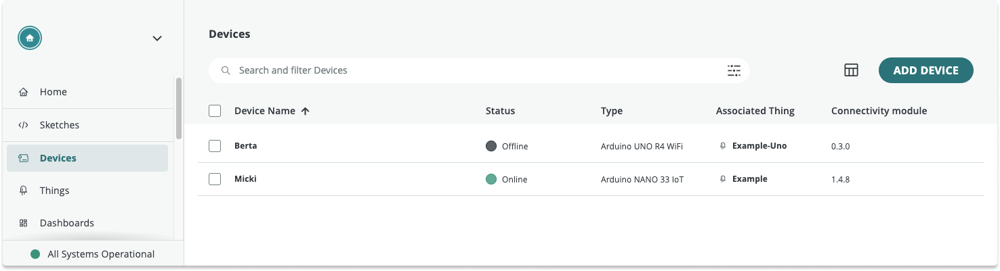

In Arduino IoT Cloud, the **device status** describes the connection between your device and the Cloud.

One of these will be displayed for each device:

| Status           | Description                                                                            |
|------------------|----------------------------------------------------------------------------------------|
| Ready to connect | The device has initialized a connection but is not connected to the Arduino IoT Cloud. |
| Online           | The device is connected and communicating with the Arduino IoT Cloud.                  |
| Offline          | The device has initialized a connection but is not connected to the Arduino IoT Cloud. |
| -                | Device status is not supported for this device.                                        |

After uploading your sketch, it may take a few minutes before the status changes to Online.

> **Note:** Device status is not supported by the LoRa communication protocol, and is not available for MKR WAN 1300, MKR WAN 1310, and other LoRa devices.

## Further reading

* [My device is not connecting to Wi-Fi or to IoT Cloud](https://support.arduino.cc/hc/en-us/articles/360019355679-My-device-is-not-connecting-to-WiFi-or-to-IoT-Cloud)
