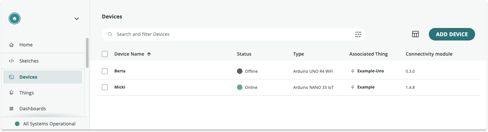

In Arduino Cloud, the **device status** describes the connection between your device and the Cloud.

> **Note:** Device status is not supported by the LoRa communication protocol, and is not available for MKR WAN 1300, MKR WAN 1310, and other LoRa devices.

One of these will be displayed for each device:

| Status           | Description                                                                            |
|------------------|----------------------------------------------------------------------------------------|
| Online           | The device is connected and communicating with the Arduino Cloud.                  |
| Offline          | The device has initialized a connection but is not connected to the Arduino Cloud. |
| Unknown                | Device status is not supported for this device. |

After uploading your sketch, it may take a few minutes before the status changes to Online.

## Device Status History

The Device Status History feature allows you to visualize the status of your device over time. To access it:

1. Go to the [Devices tab](https://app.arduino.cc/devices).

2. Click on your device's name to open a page with more information about your device.

3. The Device Status History is located at the top right side of the page.

## Further reading

* [My device is not connecting to Wi-Fi or to Arduino Cloud](https://support.arduino.cc/hc/en-us/articles/360019355679-My-device-is-not-connecting-to-WiFi-or-to-IoT-Cloud)
