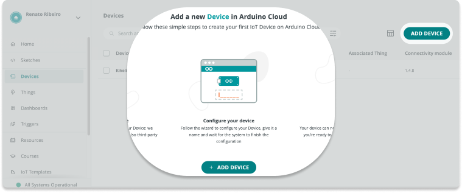

> Also see [Getting Started With the Arduino IoT Cloud](https://docs.arduino.cc/cloud/iot-cloud/tutorials/iot-cloud-getting-started) in Arduino Docs.

Connecting a new device to Arduino IoT Cloud consists of three steps:

<!--
1. [Add the device to IoT Cloud](#add-the-device).
2. [Configure a Thing sketch](#create-thing)
3. [Upload the sketch to the device](#upload-sketch)
-->

1. Add the device to IoT Cloud
2. Configure a Thing sketch
3. Upload the sketch to the device

---

## Set-up instructions

### Step 1: Add the device

1. Open Arduino IoT Cloud and open the [Devices tab](https://create.arduino.cc/iot/devices).

2. Click the **Add Device** button in the top-right or middle of the page.

   

3. Select your device type:

   * _Set up an Arduino device_: For Arduino boards.
   * _Set up a 3rd Party Device_: ESP8266, ESP32, and more.

   > Hover over the <kbd>i</kbd> for a full list of compatible devices.

4. **Proceed with the instructions to add your device.**

   * _ESP32 and ESP8266_: Make sure to save any Device ID and Secret key that's provided.
   * _LoRaWAN®:_ Make sure you select the [right frequency band for your region](https://www.thethingsnetwork.org/docs/lorawan/frequencies-by-country/). When completing the setup you'll receive a registration email for your [The Things Stack Network Account](https://docs.arduino.cc/cloud/iot-cloud/tutorials/cloud-lora-getting-started#step-2-registering-the-things-stack-network-account).

5. When finished, your new device will be added to your list of devices.

   

### Step 2: Create and configure a Thing

<!-- The network parameters will be written to the `thingProperties.h` and `Secret` sketch files. But a sketch is only generated when a variable is added, so we'll do that first. -->

1. Open the [Things tab](https://create.arduino.cc/iot/things).

2. Click **Create Thing**.

   

3. Configure **Variables**, **Device**, and **Network** for the new Thing:

   

   1. Click the **Select Device** button and select your device.

   2. Click the **Network configure** button and enter the network credentials.

      * _Wi-Fi:_ Enter your Wi-Fi name (SSID) and password (encryption key).
      * _Arduino SIM_: [Use these credentials](https://support.arduino.cc/hc/en-us/articles/360013825159-What-are-the-credentials-for-the-Arduino-SIM-card).
      _Arduino with LoRa®:_ The credentials are added automatically.
      * _ESP32 and ESP8266_: Enter the secret key that was provided when adding the device.

   3. Click **Add variable** and add one variable with any settings.

   
   <!-- TODO: Fix image -->

4. Your sketch will now be generated and can be viewed in the Sketch tab.

### Step 3: Upload the Thing sketch

1. With the Thing open, open the **Sketch** tab.

2. Click the **Upload button** and wait for the process to complete.

   

3. When the upload is finished, go back to the Thing setup tab.

4. After a short while, your device should come online. You may have to refresh the page.

   

   > **Note:** Device status is not supported by the LoRa protocol, see [About device status in IoT Cloud](https://support.arduino.cc/hc/en-us/articles/4407169649682-About-device-status-in-IoT-Cloud).

---

## Troubleshooting

*
