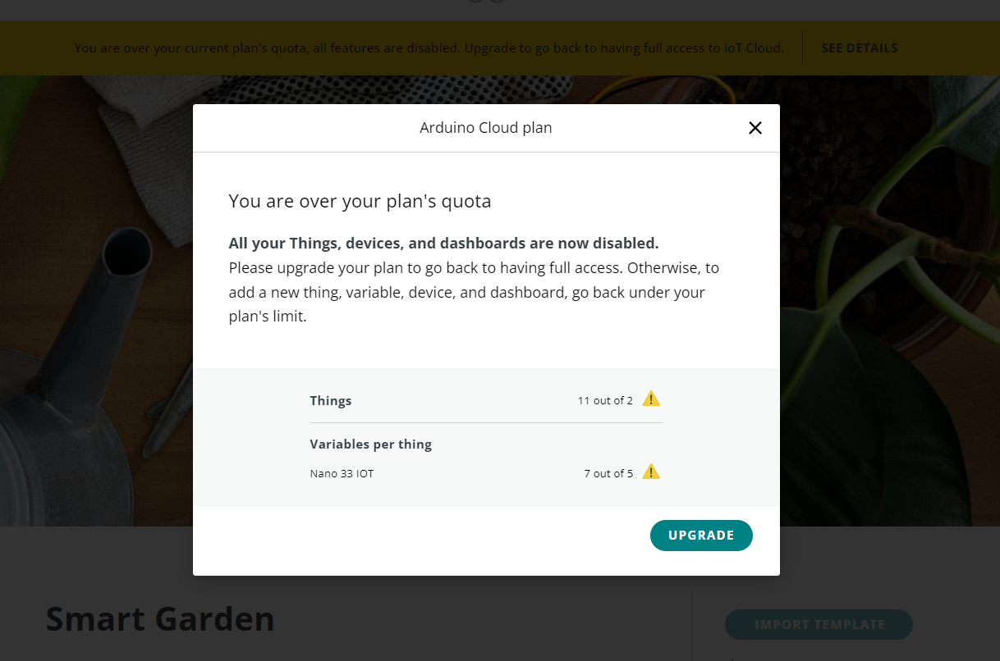
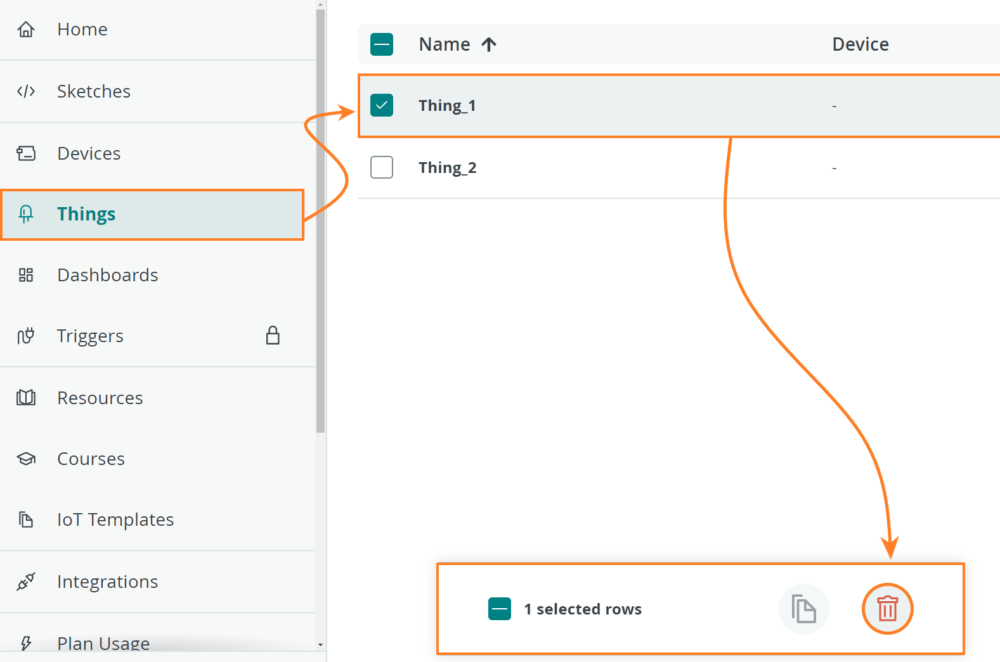
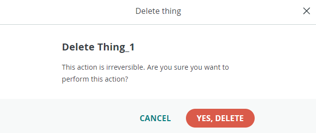

This guide aims to help you tackle common issues with [Arduino Cloud Templates](https://app.arduino.cc/templates)

* [Dealing with Library Conflicts](#conflict)
* [Import Template button disabled](#button-disabled)

## Dealing with Library Conflicts {#conflict}

With [Arduino Cloud templates](https://app.arduino.cc/templates) you can quickly create a project for a compatible board (such as the MKR WiFi 1010). When importing a template you may experience this error:

This error is often caused by imported custom libraries conflicting with the built-in libraries used in the template. The error can be resolved by removing any custom libraries that may be causing the conflict.

You can find your custom libraries by opening the [Cloud Editor](https://create.arduino.cc/editor), clicking **Libraries** in the sidebar, and selecting the **Custom** tab. If you hover over a library with the cursor, a small arrow icon will appear. Click it and select **Delete library** to remove it.

## Import Template button disabled {#button-disabled}

Occasionally, the `Import Template` button might be disabled. This could occur if you've surpassed the limit of having more than two **Things** connected to the Cloud. To resolve this, simply remove one of the **Things** to free up a spot.

### How to delete "Things" from Arduino Cloud

1. Navigate to the tab labeled [Things](https://app.arduino.cc/things). It can be found on the sidebar menu to the left.

1. Choose and select the **Things** you want to delete.

1. In the bottom right corner, press the  logo.

    

1. Press `Yes, Delete`.

    

Now you can go back to the template you intended to import and give it another try.
