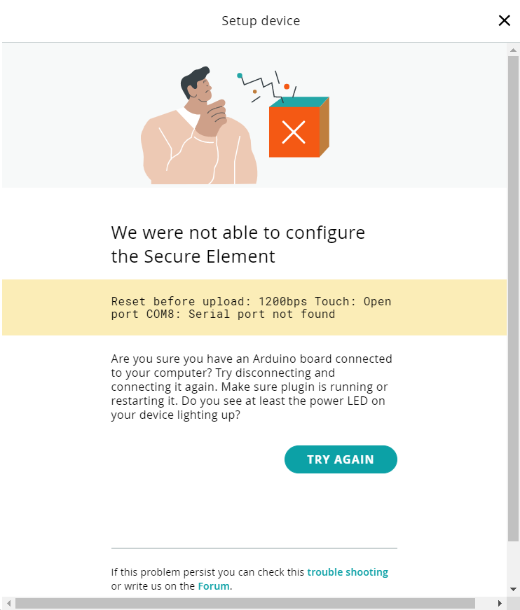

This error is triggered when the board is reset or set on bootloader mode during step 1 of the "Add device" routine.

In order to avoid it, try t resetting or setting the board in bootloader mode before starting the process.
