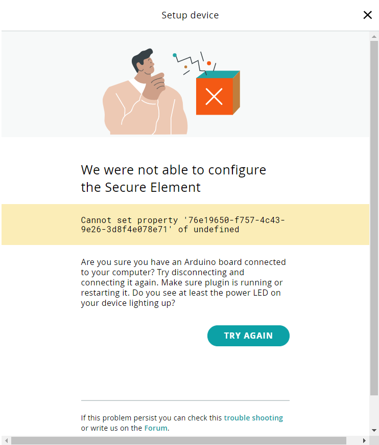

## A shield is attached to the board

This error is triggered when the board has a shield or carrier attached to it while trying to add it to the IoT Cloud. Some shields use certain pins the cloud needs to have access to in order to communicate with the board.

In order to avoid it, please remove the shield and try this process again.

## Adding a board through "Things" instead of "Devices"

This error is sometimes also triggered when adding the board from the "Things" section, our developers team is working on getting rid of this bug.

For now, please try adding the board again, this time through the [`Devices` section](https://create.arduino.cc/iot/devices).
