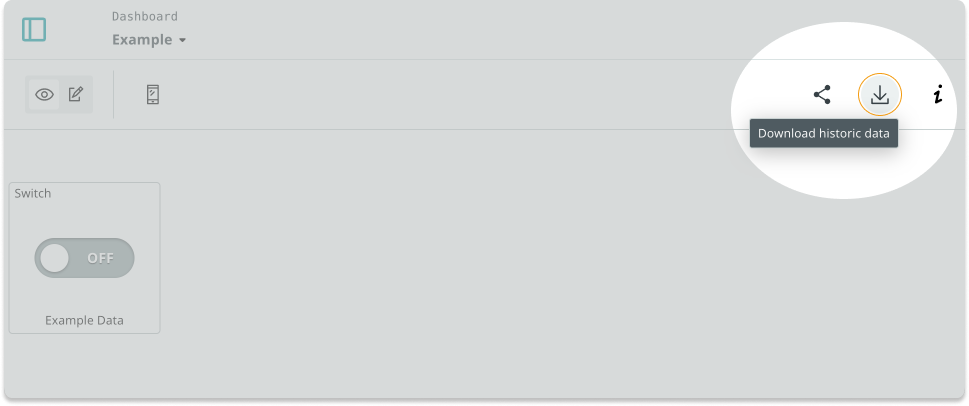

Learn how to export historical data from Arduino Cloud as CSV (comma-separated values) files.

---

## How to request historical data

Follow these steps to request a download link:

1. Open a dashboard that's configured with at least one variable.

2. Press the **Download** button in the top-right corner.

   

3. Select the variables you want to include in the downloaded data.

4. Click the **Select Data Source** button.

5. Click the **Get Data** button.

6. An email will be sent to the email address associated with your Arduino account. Click the **Download** link inside the email to download the data.

The download consists of a Zip archive, which includes these files:

* **CSV (comma-separated values)** files (one for each exported variable)
* A `readme.txt` file with some additional information about the variables, and the data range of the exported data.

---

## Further reading

* [Historical Data on Arduino Cloud (Arduino Docs)](https://docs.arduino.cc/arduino-cloud/features/iot-cloud-historical-data)
