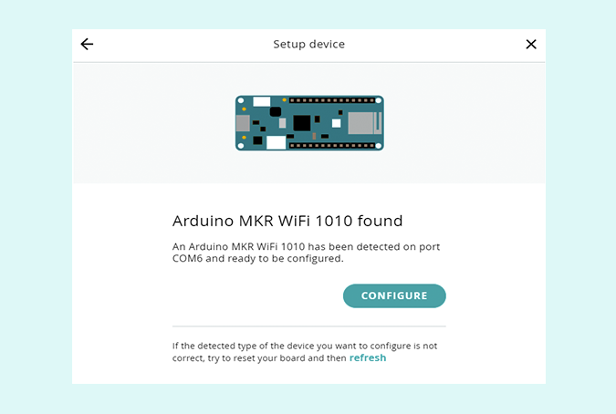
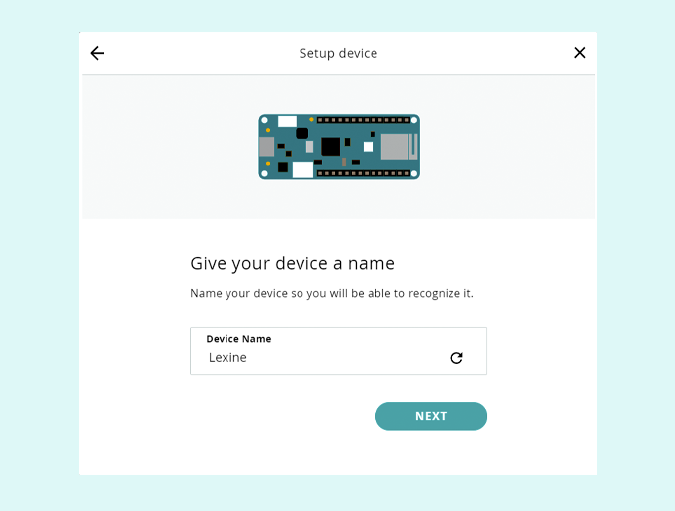
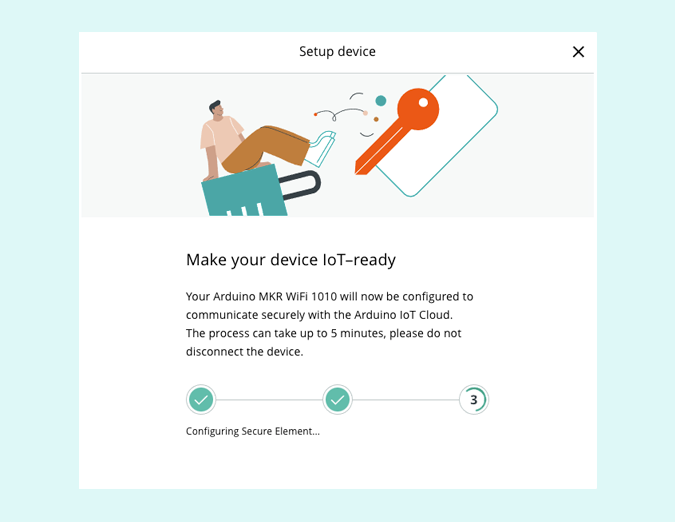
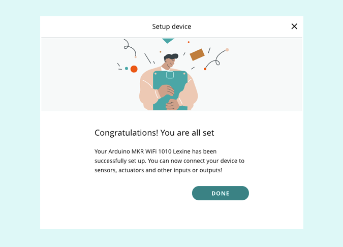

Learn how to connect Arduino devices to the Arduino IoT Cloud.

---

1. Go to the [IoT Cloud](https://create.arduino.cc/iot).

2. Sign in to your account.

3. On top of the page, click the `Devices` tab.

4. Click the `Add Device` button.

5. Select the `Set up an Arduino device` section in the pop-up window.

   

   > The [Arduino Create Agent](https://create.arduino.cc/getting-started/plugin/welcome) has to be installed and running. If prompted, follow the installation instructions.

6. Once the board is detected by the computer and the cloud, the `Configure` button will be enabled, press it to continue.

   

7. Give your device a name and click `Next`.

   

8. Wait for the setup process to complete.

   

9. When the setup is complete, click `Done`.

   

Your device is now available in the [Devices tab](https://create.arduino.cc/iot/devices)!

## Troubleshooting

In case you have any issues configuring your device, you can try the following:

- Make sure you are using a Data USB cable
- Unplug and reconnect your device.
- If you're configuring a board, press the reset button twice in quick succession while the board is connected, to reset the bootloader.
- If possible, connect the device directly to a USB port on your computer, and not through a USB hub.
- If the Desktop IDE och Web Editor is running on your computer, try closing it.
