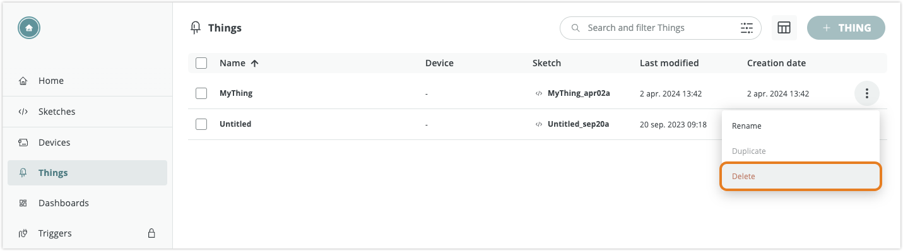
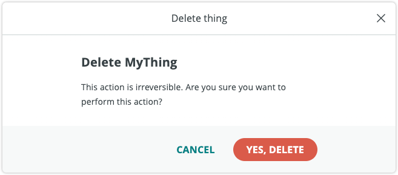
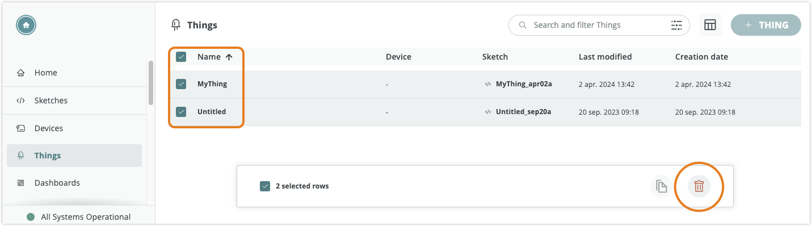

Learn how to delete Things in Arduino Cloud.

---

## Deleting a single Thing

1. Open the [Things tab](https://app.arduino.cc/things).

1. With your mouse cursor, hover over the Thing you want to delete. Click on the three dots button that appears on the right, and choose "Delete".

    

1. Click **Yes, Delete** to confirm.

    

## Delete multiple Things

1. Open the [Things tab](https://app.arduino.cc/things).

1. Select the Thing(s) you want to delete by checking the boxes to the left in the Thing row.

   

1. Click the  **Delete** button to remove the selected Things.

1. Click **Yes, Delete** to confirm.

   
