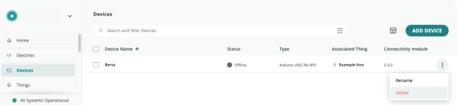

Configured devices can be deleted if you're no longer using them or if you've reached the maximum number of devices with your plan.

---

## Deleting a single device

1. Go to the [Devices tab](https://create.arduino.cc/iot/devices).

2. With your mouse cursor, hover over the device you want to delete. Click on the three dots button that appears on the right, and choose "Delete".

   

3. Confirm deletion of the device by clicking "Yes, Delete".

   

---

## Deleting multiple devices

1. Go to the [Devices tab](https://create.arduino.cc/iot/devices).

   

2. Select the device(s) you want to delete by checking the boxes to the left in the device row.

   Then, click the Delete button in the bottom right.

   

3. Confirm the deletion by clicking "Yes, Delete".

   
