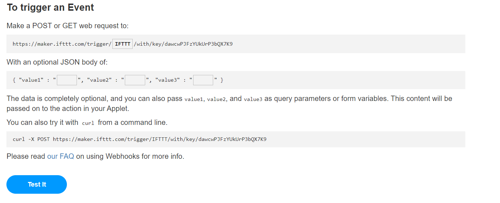
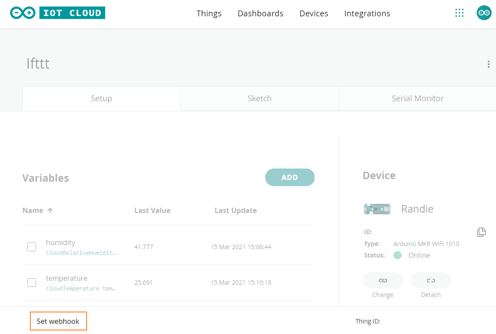
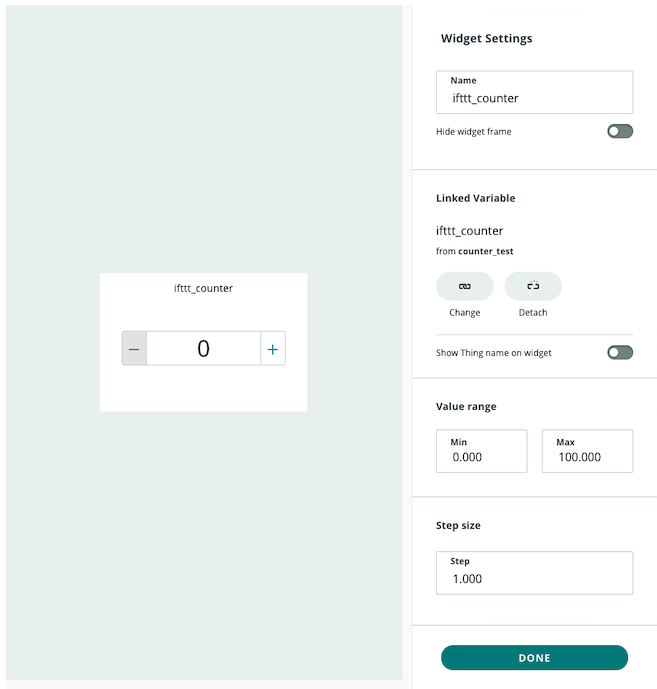

This article will show you how to connect your Arduino Cloud to an IFTTT webhook. As an example, we'll configure a webhook to send data to an email address when a variable is changed.

 You will need:

* An Arduino account
* An [IFTTT account](https://ifttt.com/)
* A 'Thing' that you want to configure with IFTTT.

> For a general overview of Arduino Cloud, see [this page](https://www.arduino.cc/en/IoT/HomePage).

## Creating an applet in IFTTT

First, we'll create an applet in IFTTT that will send an email when triggered by a webhook.

---

1. Open [maker.ifttt.com](https://maker.ifttt.com/) and sign in if prompted.

2. Click **Create** in the top right. Select **If This**.

3. In the search field, enter 'Webhooks' and select that service.

4. Select **Receive a web request**.

5. In the **Event Name** field, enter `counter_change`.

6. Click the **Create trigger** button.

7. Now, click on **Then That**. Select the **Email** service.

8. Choose the **Send me an email** action. If this is your first time setting up an email action, click **Connect**, and proceed with the configuration as instructed on IFTTT.

9. We can now configure the content of the email. The subject and body fields can be left as is, or changed to your preference. `{{Value1}}`, `{{Value2}}` and `{{Value3}}` will correspond to the variable name (ifttt_counter), the new value, and a timestamp of the change, respectively. Finally, click **Create action**.

10. Both the trigger and action have now been configured. Click **Continue**.

11. Optionally, change the applet title, and click **Finish** to create the applet.

12. Click on your profile picture in the top right, then click **My services**. Choose webhooks and click on **Documentation** in the upper right.

    

13. Write `counter_change` in **{event}** field and copy the URL from the curl command (we'll use it in the next section).

## Creating a Thing in Arduino Cloud

Next, we'll create a Thing that will use the webhook to trigger the IFTTT applet.

---

1. Go to [Arduino Cloud](https://app.arduino.cc/). If prompted, sign in to your Arduino account.

2. In the **Things** tab, click **CREATE THING**.

3. Initially, the title will be set to 'Untitled'. Click on it and give it a name.

4. Click **ADD** and enter the following values:

   * **Name:** ifttt_counter
   * **Variable type:** Counter
   * **Variable Permission:** Read & Write
   * **Variable Update Policy:** On change
   * **Threshold:** 1

   Click **ADD VARIABLE** to create the variable.

5. With the variable created, click **Set webhook** at the bottom left of the page.

   

6. Paste the URL inside the **Webhook URL** field and click **SET WEBHOOK**.

7. Open the **Dashboards** tab, then either open an existing dashboard or click **BUILD DASHBOARD**.

   

8. Enable the editing mode (notebook symbol) and click **ADD**. Under the **THINGS** tab, select the thing you created. Click **CREATE WIDGETS** with `ifttt_counter` selected. Make sure that the step size is set to 1.000. Click **DONE**.

   

9. Test the webhook and IFTTT applet by increasing the counter value. You should receive an email shortly.

## Troubleshooting

If you're not receiving any emails, make sure that

* you've set a webhook in your thing.
* that the `{{event name}}` in the webhook URL is the same as the event name in the IFTTT web request trigger.
