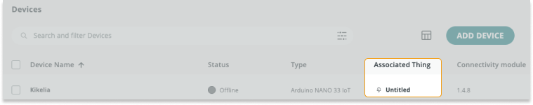

> [!NOTE]
> Device status is not supported by the LoRa protocol, see [About device status in Arduino Cloud](https://support.arduino.cc/hc/en-us/articles/4407169649682-About-device-status-in-IoT-Cloud).

1. Go to the [Devices tab](https://app.arduino.cc/devices) and verify that your device has an associated Thing. If not, you must either create and new Thing or associate an existing Thing with the device.

   

2. Go to the [Things tab](https://app.arduino.cc/things) and open the Thing that's associated with your device. Then go to the [Devices tab](https://app.arduino.cc/devices), and find your device in the list. Under **Network**, click on **Change** and verify that your credentials are correct.

   > [!NOTE]
   >  Make sure the name (also called _SSID_) and password (also called _encryption key_ or just _key_) are correct. The password can be revealed by clicking the eye symbol. If you don't know your network name or password, contact your network administrator or the manufacturer of your Wi-Fi access point. If your device has a secret key, make sure it's entered correctly (if you're unsure, remove and re-add the device to generate a new key).

3. Open the Thing's **Sketch tab**. Make sure the right device is selected and re-upload the sketch.

   

4. Fully [delete the device](https://support.arduino.cc/hc/en-us/articles/360018324700), then add it again as a new device. For detailed instructions, see [Add and connect a device to Arduino Cloud](https://support.arduino.cc/hc/en-us/articles/360016495559).

5. Test your setup with an example from the [ArduinoIoTCloud library](https://www.arduino.cc/reference/en/libraries/arduinoiotcloud/). Upload using Arduino IDE or the [Cloud Editor](https://support.arduino.cc/hc/en-us/articles/13809101080732-Open-the-Cloud-Editor).

6. Check your device's power supply. Avoid using a USB hub, and instead connect the board directly to a USB port or another power source with a reliable cable to ensure sufficient power.
