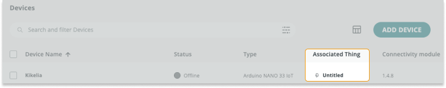

Learn how to resolve problems adding and connecting devices to IoT Cloud.

If you haven't done so, [make sure the device is configured correctly](https://support.arduino.cc/hc/en-us/articles/360016495559), then see the sections below.

1. [Problems adding the device](#add-device). If there's a problem during the **"Add device"** set-up process, and the device doesn't appear in the Device tab.
2. [Problems uploading the sketch](#sketch-upload). If there's a problem when uploading the Thing sketch to your device.
3. [If the device doesn't come online](#device-status). If the sketch uploads but the device doesn't come online.

---

## Problems adding the device

### We could not find any Arduino device

1. Make sure you're using a [compatible device](https://support.arduino.cc/hc/en-us/articles/360016077320-What-devices-can-be-used-with-Arduino-IoT-Cloud-).

2. [Check if the Arduino Create Agent is installed and running](https://support.arduino.cc/hc/en-us/articles/4980687506844-Check-if-the-Arduino-Create-Agent-is-installed-and-running), then click **Try again**.

3. Double-press the reset button on the board, then click **Try Again**.

4. Try uploading an Example sketch (such as _Examples > Built in > 01.Basics > Blink_) in the [Web Editor](https://create.arduino.cc/editor).

   * If your board isn't detected by the Web Editor, see [If your board does not appear in the port menu](https://support.arduino.cc/hc/en-us/articles/4412955149586-If-your-board-does-not-appear-in-the-port-menu).

   * If you get an error message when uploading, see [Errors when uploading a sketch](https://support.arduino.cc/hc/en-us/articles/4403365313810-Errors-when-uploading-a-sketch).

### We were not able to configure your device Something went wrong!

1. Close any instances Arduino IDE and other applications that may be using the port.

2. [Check if the Arduino Create Agent is installed and running](https://support.arduino.cc/hc/en-us/articles/4980687506844-Check-if-the-Arduino-Create-Agent-is-installed-and-running).

3. Reconnect the device to the computer and make sure the power LED lights up.

### Arduino Create Agent not found

1. If you haven't done so already, [install the agent](https://create.arduino.cc/getting-started/plugin/welcome).
2. If you have installed the agent but you still encounter this warning, see [If Arduino Create Agent isn't detected](https://support.arduino.cc/hc/en-us/articles/360016466600-Warning-To-upload-a-sketch-via-USB-port-make-sure-the-Agent-is-installed-and-running-on-this-computer).

### If you don't know the DevEUI for your Arduino board

Make sure to set up your Arduino board as an Arduino device.

The DevEUI will be automatically added to the device.

### If you don't know the secret key for your 3rd party device

Secret keys cannot be recovered if lost. Generate a new key by [deleting the device](https://support.arduino.cc/hc/en-us/articles/360018324700-How-to-delete-a-device-from-Arduino-IoT-cloud), then adding it again.

### 'We were not able to configure...' during device set-up

These errors can occur with boards using older Wi-Fi module firmware:

* `Couldn't get the firmware info: Start command: exec: "{runtime.tools.fwupdater.path}/FirmwareUploader": file does not exist`
* `Reset before upload: 1200bps Touch: Open port COMB: Serial port not found`
* `Can't update firmware: Executing command: exit status 1`

Normally, IoT Cloud will update the firmware automatically, but this may fail on older versions (before 1.4.1). To check the firmware version on your board and update it, see [Check the WiFiNINA firmware version](https://support.arduino.cc/hc/en-us/articles/9398559561244-Check-the-WiFiNINA-firmware-version).

---

## Problems uploading the sketch

### No associated device found

1. Open the [Things tab](https://create.arduino.cc/iot/things) to see which device is associated with the Thing.

2. Make sure the associated device is connected to your computer. To associate a different device, open the Thing and click the **Device selection** button.

### Executing command: exit status 1

This is a generic error message indicating that a process has failed.

1. Click the **Open full editor** button. This will open the same sketch in the Web Editor.

2. Upload the sketch and observe the console output.

3. If you get an error message, see [Errors when uploading a sketch](https://support.arduino.cc/hc/en-us/articles/4403365313810-Errors-when-uploading-a-sketch).

### To upload a sketch via USB port, make sure the Agent is installed and running on this computer

1. If you haven't done so already, [install the agent](https://create.arduino.cc/getting-started/plugin/welcome).
2. If you have installed the agent but you still encounter this warning, see [If Arduino Create Agent isn't detected](https://support.arduino.cc/hc/en-us/articles/360016466600-Warning-To-upload-a-sketch-via-USB-port-make-sure-the-Agent-is-installed-and-running-on-this-computer).

---

## If the sketch uploads but the device isn't online

> **Note:** Device status is not supported by the LoRa protocol, see [About device status in IoT Cloud](https://support.arduino.cc/hc/en-us/articles/4407169649682-About-device-status-in-IoT-Cloud).

1. Go to the [Devices tab](https://create.arduino.cc/iot/devices) and verify that your device has a linked Thing. If not, you must either create and new Thing, or associate an existing Thing with the device.

   

2. Go to the [Things tab](https://create.arduino.cc/iot/things) and open the Thing that's associated to your device. Then go to the [Devices tab](https://create.arduino.cc/iot/devices), and find your device in the list. Under **Network**, click on **Change** and verify that your credentials are correct.

   * **Wi-Fi:** Make sure the name (also called _SSID_) and password (also called _encryption key_ or just _key_) are correct. The password can be revealed by clicking the eye symbol. If you don't know your network name or password, contact your network administrator or the manufacturer of your Wi-Fi access point. If your device has a secret key, make sure it's entered correctly (if you're unsure, remove and re-add the device to generate a new key).
   * **Arduino SIM:** [Use these credentials](https://support.arduino.cc/hc/en-us/articles/360013825159). Make sure a working GSM antenna is connected to the board and that an Arduino SIM plan is activated with [your account](https://store.arduino.cc/digital/subscriptions/plans).

3. Open the Thing's **Sketch tab**. Make sure the right device is selected and re-upload the sketch.

   

4. Fully [delete the device](https://support.arduino.cc/hc/en-us/articles/360018324700), then add it again as a new device. For detailed instructions, see [Add and connect a device to IoT Cloud](https://support.arduino.cc/hc/en-us/articles/360016495559).

5. Test your setup with an example from the [ArduinoIoTCloud library](https://www.arduino.cc/reference/en/libraries/arduinoiotcloud/). Upload using Arduino IDE or the [Web Editor](https://create.arduino.cc/editor).

---

## Still need help?

[Contact us](https://www.arduino.cc/en/contact-us/).

<!-- markdownlint-disable-file HC001 -->
<!-- markdownlint-disable-file MD026 -->
