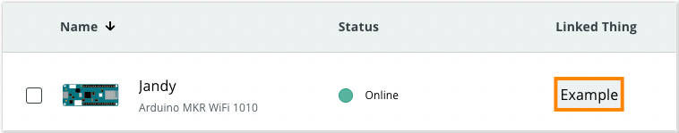

Follow these steps if your device has an 'Offline' status in the Device tab.

---

1. Go to the [Devices tab](https://create.arduino.cc/iot/devices) and find your device in the list.

2. Under **Linked Thing**, find the Thing name.

   

3. Go to the [Things tab](https://create.arduino.cc/iot/things) and open the Thing linked with your device.

4. Under **Network**, click on Change and verify that your credentials are correct.

   * **Wi-Fi:** Make sure the name (also called _SSID_) and password (also called _encryption key_ or just _key_) are correct. The password can be revealed by clicking the eye symbol. If you don't know your network name or password, contact your network administrator or the manufacturer of your Wi-Fi access point.
   * **Arduino SIM:** [Use these credentials](https://support.arduino.cc/hc/en-us/articles/360013825159). Also, make sure that an Arduino SIM plan is activated with [your account](https://store.arduino.cc/digital/subscriptions/plans).

5. Under **Variables**, make sure at least one variable is created. If not, click ADD to create one.

6. Click on the **Sketch** tab.

7. Click on the Upload button and wait for the process to complete.

   

   > If no associated device is found, see [If your board does not appear in the port menu](https://support.arduino.cc/hc/en-us/articles/4412955149586-If-your-board-does-not-appear-in-the-port-menu).

8. Go back to the [Devices tab](https://create.arduino.cc/iot/devices). Refresh the page after one minute and see if the device comes online.

## If the device is still offline

* Rule out other problems by uploading the `Blink` sketch (Examples > Basics > Blink) in the [Web Editor](https://create.arduino.cc/editor).
* [Delete the device](https://support.arduino.cc/hc/en-us/articles/360018324700) and add the device again as a new device from the Device tab. Associate a new Thing with at least one variable and upload the sketch. For more help with setting up your device, see [Add an Arduino device to IoT Cloud](https://support.arduino.cc/hc/en-us/articles/360016495559).

## Still need help?

[Contact us](https://www.arduino.cc/en/contact-us/).
