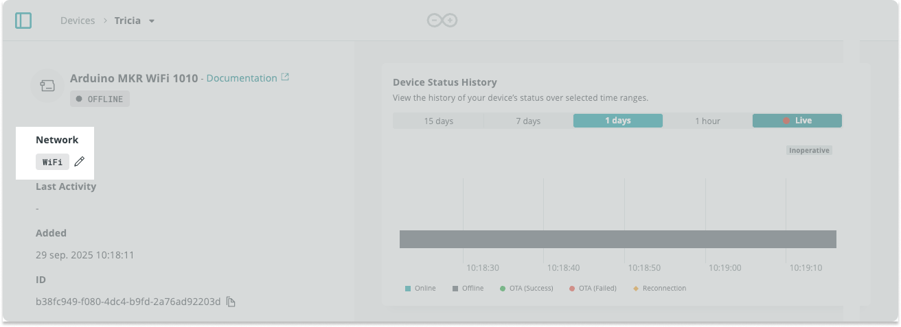
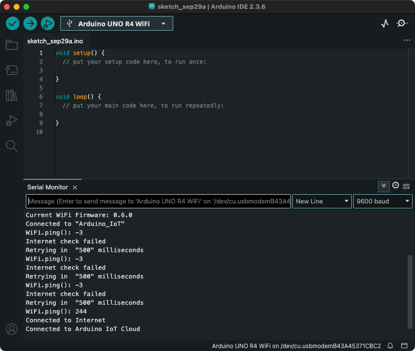

Learn what to do if your device has the **offline** status in Arduino Cloud.

Before you begin:

- If you experience an issue when adding a device to Arduino Cloud, see [If your device can't be added to Arduino Cloud](https://support.arduino.cc/hc/en-us/articles/360019355679).
- Understand that device status is not supported by LoRa devices and that these devices will always appear as offline. See [About device status in Arduino Cloud](https://support.arduino.cc/hc/en-us/articles/4407169649682-About-device-status-in-IoT-Cloud).

In this article:

- [Check power and restart](#check-power-and-restart)
- [Verify network credentials and reupload the Thing sketch](#verify-network-credentials-and-reupload-the-thing-sketch)
- [Check your network settings](#check-your-network-settings)
- [Check the serial output](#check-the-serial-output)
- [Delete the device](#delete-the-device)

---

## Check power and restart

- Disconnect and reconnect the device power.
- Verify that the device is powered by checking the power LED.
  - _Exception:_ The Arduino Opta has no power LED, so it may be powered even if no LEDs are lit.
- If device is connecting via Wi-Fi, ensure that your Wi-Fi router or access point is turned on and accessible.

## Verify network credentials and reupload the Thing sketch

The sketch the device is running needs to be configured for Arduino Cloud. This happens automatically when you add and use your device with Arduino Cloud. If a different sketch is uploaded to the device, it will not connect to Arduino Cloud.

You can ensure that your device is running the right sketch by reuploading the Cloud sketch from the Thing:

1. Find the **Network** section on the device page:

   - If a network has been configured, it will display the network **name**.

   - If a network has **not** been configured, it will display the network **type**.

   

1. Select the network name or type to configure the credentials.

1. If prompted, create or associate an Thing to your device.

1. If prompted, select an update method and connect your board.

1. Configure your network credentials:
    - _Wi-Fi:_ Enter your Wi-Fi name (SSID) and password (encryption key).
    - _ESP32/ESP8266:_ Use the secret key that was provided when adding the device. If you don't know your secret key, [delete your device and add it again](#delete-the-device) to get a new key.
    - _Arduino device with LoRa®:_ The credentials are added automatically when you configure your device. To reset the credentials, [delete your device and add it again](#delete-the-device).

1. One of the following will happen:

   - The network credentials will immediately be updated and you'll return to the device page.

   - A manual sketch upload will be required to update the credentials.

   If prompted, upload the sketch to update the network credentials on your device.

> [!NOTE]
> Make sure the name (also called _SSID_) and password (also called _encryption key_ or just _key_) are correct. The password can be revealed by clicking the eye symbol. If you don't know your network name or password, contact your network administrator or the manufacturer of your Wi-Fi access point. If your device has a secret key, make sure it's entered correctly (if you're unsure, [remove and re-add the device](#delete-the-device) to generate a new key).

## Check your network settings

A home network with a default configuration will usually not prevent any Arduino Cloud connections.

[Learn how to configure your network for Arduino Cloud](https://support.arduino.cc/hc/en-us/articles/360017279260-Configure-your-network-for-Arduino-Cloud){.link-chevron-right}

## Check the serial output

Connect to your device via USB and read the serial output for additional information:

1. Open Arduino IDE or Arduino Cloud Editor.
1. Connect your device to your computer.
1. Select your device in the editor.
1. Open the Serial Monitor.
1. Read the output to better understand what happens as your device tries to connect to Arduino Cloud.
1. If your device is not sending any serial output, try pressing the reset button on your device to restart the sketch. If you still don't see any output, the device may not be running the Cloud sketch. In that case, [verify your network credentials and reupload the Thing sketch](#verify-network-credentials-and-reupload-the-thing-sketch).

<!-- Test your setup with an example from the [ArduinoIoTCloud library](https://docs.arduino.cc/libraries/arduinoiotcloud/). Upload using Arduino IDE or the [Cloud Editor](https://support.arduino.cc/hc/en-us/articles/13809101080732-Open-the-Cloud-Editor). -->

## Delete the device

Fully delete the device, then add it as a new device.

1. [Delete the device from Arduino Cloud](https://support.arduino.cc/hc/en-us/articles/360018324700).
2. [Add the device to Arduino Cloud again](https://support.arduino.cc/hc/en-us/articles/360016495559).
3. Optionally, associate the Thing that was linked to the device.
