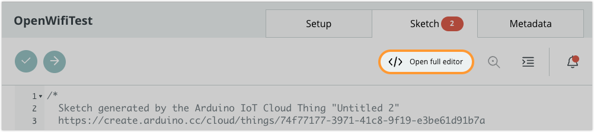
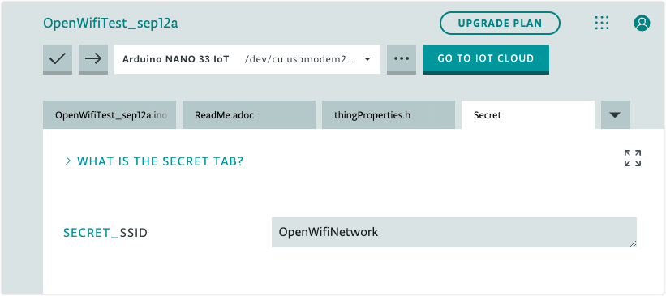
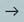
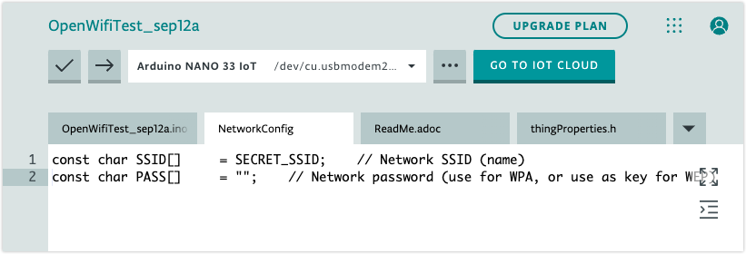

A network configuration in IoT Cloud cannot be saved unless all network parameters for all fields is provided. Some networks may not have all parameters, such as:

* Open (unencrypted) Wi-Fi networks.
* Cellular providers not requiring PIN, username, or password.

To use device with these network configurations, you can [set the parameters in the Web Editor](#set-with-web-editor).

---

<a id="set-with-web-editor"></a>

## Set network parameters with the Web Editor

1. Open your Thing in [IoT Cloud](https://create.arduino.cc/iot/things).

2. Click the **Sketch** tab.

3. Click **Open full editor** to view the sketch in the Web Editor.

   

4. Open the `thingsProperties.h` file tab.

   ![The SSID[] and PASS[] variables.](img/web-editor-properties-open-wifi.png)

5. Find the rows where the `SECRET` variables are assigned, like:

   ```arduino
   const char SSID[]     = SECRET_SSID;    // Network SSID (name)
   const char PASS[]     = SECRET_PASS;    // Network password (use for WPA, or use as key for WEP)
   ```

   Edit the parameters you **don't** want to use to assign an empty string (`""`):

   ```arduino
   const char SSID[]     = SECRET_SSID;    // Network SSID (name)
   const char PASS[]     = "";    // Network password (use for WPA, or use as key for WEP)
   ```

6. Go to the `Secret` tab and verify that remaining secrets (such as `SECRET_APN` or `SECRET_SSID`) are correct.

   

7. Click the  **Upload** button to upload directly from the Web Editor, or go back to IoT Cloud and upload from the sketch tab.

**Note:** Each time the sketch is updated from IoT Cloud (by adding or changing Variables), the changes made to `thingsProperties.h` in the Web Editor will be overwritten. To upload the sketch again, simply repeat the steps above.

---

## Examples

Here are some example network configurations that can be declared in `thingsProperties.h`.

Remember to set the remaining secrets in the `Secret` tab.

### Open Wi-Fi network

```arduino
const char SSID[]     = SECRET_SSID;    // Network SSID (name)
const char PASS[]     = "";    // Network password (use for WPA, or use as key for WEP)
```

### Open Wi-Fi network (ESP32)

```arduino
const char SSID[]               = SECRET_SSID;    // Network SSID (name)
const char PASS[]               = "";    // Network password (use for WPA, or use as key for WEP)
const char DEVICE_KEY[]  = SECRET_DEVICE_KEY;    // Secret device password
```

### Third-party GSM provider

```arduino
const char GPRS_APN[]      = SECRET_APN;
const char PINNUMBER[]     = "";
const char GPRS_LOGIN[]    = "";
const char GPRS_PASSWORD[] = "";
```

---

## Save the modified lines in a tab for quick access

To make it easier to restore your configuration after updating your sketch, you can keep the modified lines in a different tab:

1. To the right of the tab row, click ▼.

2. Click _Add Tab_.

3. Give the new tab a name like "NetworkConfig".

4. Copy and paste the modified lines from `thingsProperties.h` and paste them in this file.

   

5. When you need to restore your network configuration, copy and paste the edited lines into the `thingsProperties.h` tab.
