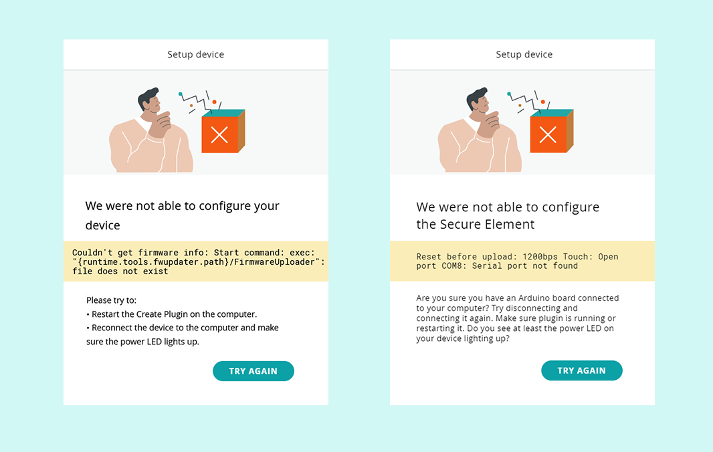

This article covers common errors triggered in the last step of the "Add a new device" routine in the Arduino IoT Cloud.

* **We were not able to configure your device**

  ```
  Couldn't get the firmware info: Start command: exec: "{runtime.tools.fwupdater.path}/FirmwareUploader": file does not exist
  ```

* **We were not able to configure the Secure Element**

  ```
  Reset before upload: 1200bps Touch: Open port COMB: Serial port not found
  ```

  ```
  Can't update firmware: Executing command: exit status 1
  ```

These errors occur due to known problems with the Wi-Fi module firmware. To resolve it, [update the firmware](https://support.arduino.cc/hc/en-us/articles/360013896579) to version 1.4.1 or later. *Note that this version may not yet be available in the stable IDE release*, download the hourly build to get the latest firmware.
