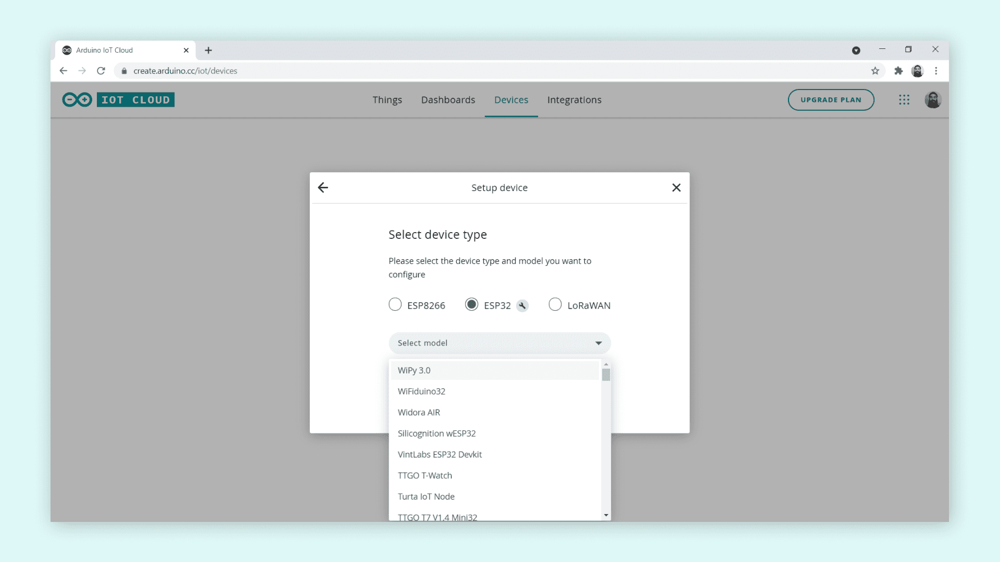
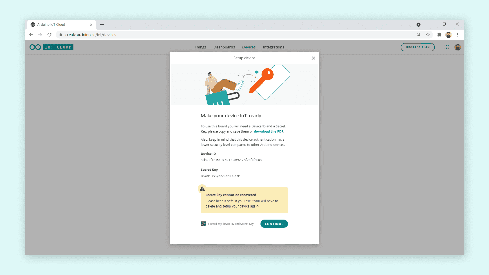
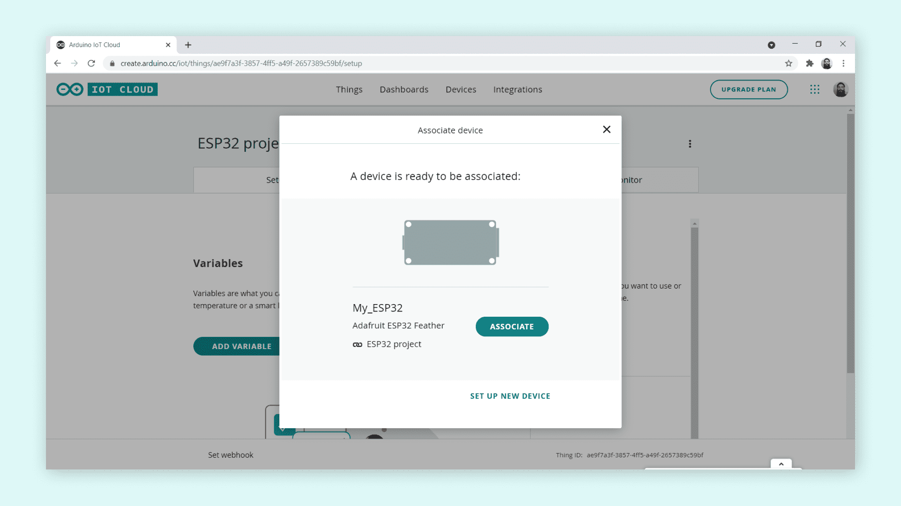
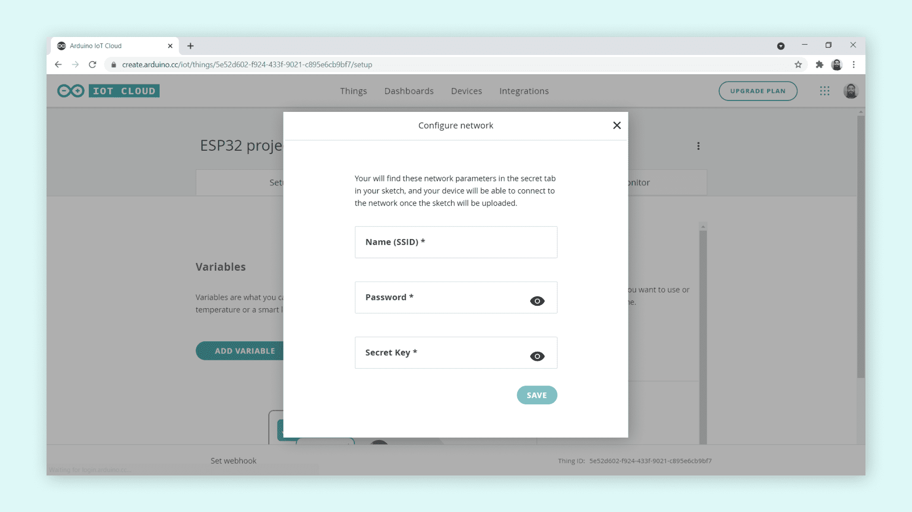

When ESP8266 or ESP32 fails to connect successfully to the Arduino IoT cloud, the following steps can be taken to troubleshot the setup.

---

1. Make sure the latest **Arduino Create Agent** is installed. [You can download the Create Agent here](https://create.arduino.cc/getting-started/plugin/welcome).

2. Check that the **Device** setup is done correctly

   Setting up the device properly will ensure that the board will connect to the IoT cloud. To ensure this:

   * Set up the board as a **3rd Party Device**

     

   * Check if the correct **Device Type** and **Model** are selected.

     The board will not connect to the IoT cloud if the wrong device type or model is selected.

     

     > Note: The device type and model are written on the back of the board.

   * Generate **Device ID and Secret Key**

     ESP8266 and ESP32 use a generated device ID and secret key in the network configuration setting to connect to a network (like Wi-Fi) for IoT cloud connectivity.

     

     If the secret key is lost, a new one can be generated by carrying out the device setup again.

3. Check if the **Device** is linked to the **Thing** created

   Once the device setup is complete, the **Device** must be associated with the **Thing** created. This can be done from the **Device** section.

   

4. Check if the **Network** settings are correct

   Add the Wi-Fi network **Name(SSID)** and **Password**. Ensure also that the **Secret Key** generated is added correctly.

   

   If any of these parameters is added incorrectly, the board will not connect to the IoT cloud.
